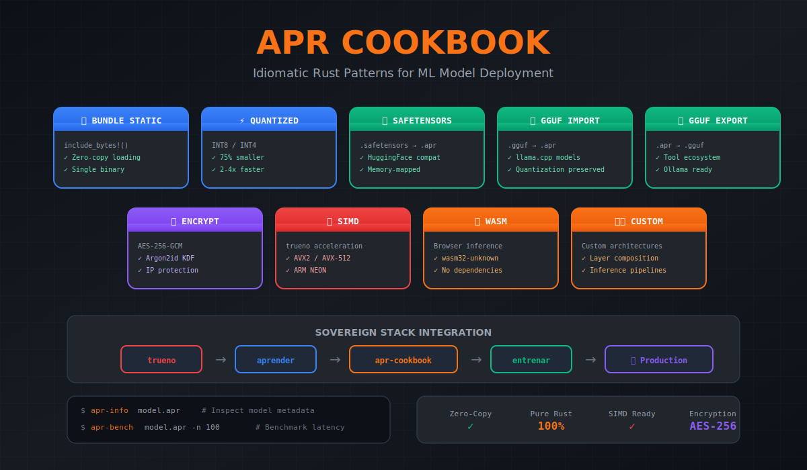

<div align="center">

# APR Cookbook

> Production recipes for ML model deployment — bundling, conversion, and acceleration in pure Rust

[](https://github.com/paiml/apr-cookbook/actions/workflows/ci.yml)
[](https://github.com/paiml/apr-cookbook/actions/workflows/book.yml)
[](https://opensource.org/licenses/MIT)
[](https://www.rust-lang.org/)
[](https://paiml.github.io/apr-cookbook/)

</div>



[](https://www.youtube.com/live/MoQ-kiOm57Q?si=KGhHRY42YDV-_iRB)
> **Watch:** Vision for the `.apr` ML model format

## Table of Contents

- [Overview](#overview)
- [Installation](#installation)
- [Quick Start](#quick-start)
- [Recipe Categories](#recipe-categories)
- [Examples](#examples)
- [Usage](#usage)
- [Contributing](#contributing)
- [Documentation](#documentation)
- [Development](#development)
- [License](#license)

## Overview

APR Cookbook provides **52 production-ready recipes** across 12 categories for deploying ML models using the APR format. Each recipe is isolated, idempotent, and verified with property-based tests following Toyota Way quality principles.

### Key Capabilities

- **Zero-Copy Loading**: Embed models with `include_bytes!()` for instant startup
- **Format Conversion**: SafeTensors, GGUF, ONNX to/from APR
- **Binary Bundling**: Single-file deployments with optional encryption
- **Acceleration**: SIMD, GPU, and WebGPU backends via trueno
- **Serverless**: Lambda, Edge Functions, and WASM deployment patterns

### Live Demos

See APR models in action with GPU/SIMD-accelerated WebAssembly:

| Demo | Description | Link |
|------|-------------|------|
| 📈 **Monte Carlo S&P 500** | GPU/SIMD-accelerated portfolio simulation with 100K+ paths/sec. Real-time risk metrics (VaR, CVaR, Sharpe) using `.apr` model for historical data. | [Launch →](https://interactive.paiml.com/monte-carlo-sp500/) |
| 🐚 **Shell ML Autocomplete** | N-gram Markov Model shell autocomplete. Statistical language model bundled as `.apr` for instant browser loading. | [Launch →](https://interactive.paiml.com/shell-ml/) |
| 🎮 **Pong** | Classic Pong game powered by [jugar](https://github.com/paiml/jugar) game engine with `.apr` model integration for WASM deployment. | [Launch →](https://interactive.paiml.com/pong/index.html) |

## Installation

Add to your `Cargo.toml`:

```toml
[dependencies]
apr-cookbook = "0.1"
```

With optional features:

```toml
[dependencies]
apr-cookbook = { version = "0.1", features = ["encryption", "training"] }
```

## Quick Start

```rust
use apr_cookbook::prelude::*;

// Bundle a model at compile time
const MODEL: &[u8] = include_bytes!("model.apr");

fn main() -> Result<()> {
    // Zero-copy load
    let model = BundledModel::from_bytes(MODEL)?;
    println!("Loaded: {} ({} bytes)", model.name(), model.size());

    // Run inference
    let output = model.infer(&input)?;
    Ok(())
}
```

## Recipe Categories

```
┌─────────────────────────────────────────────────────────────────┐
│                    APR Cookbook (52 Recipes)                    │
├─────────────────────────────────────────────────────────────────┤
│  A: Creation (5)      │  B: Bundling (7)    │  C: Training (4)  │
│  D: Conversion (5)    │  E: Registry (4)    │  F: API (4)       │
│  G: Serverless (4)    │  H: WASM (5)        │  I: GPU (4)       │
│  J: SIMD (4)          │  K: Distillation (4)│  L: CLI (4)       │
├─────────────────────────────────────────────────────────────────┤
│                    aprender v0.14.0                             │
│                 (ML Algorithms & APR Format)                    │
├─────────────────────────────────────────────────────────────────┤
│                     trueno v0.7.3                               │
│                (SIMD/GPU Compute Primitives)                    │
└─────────────────────────────────────────────────────────────────┘
```

### Category Overview

| Category | Recipes | Description |
|----------|---------|-------------|
| **A: Model Creation** | 5 | Build models from scratch: regression, trees, clustering, n-grams |
| **B: Binary Bundling** | 7 | Embed models: static, quantized, encrypted, signed, Lambda |
| **C: Continuous Training** | 4 | Incremental, online, federated, curriculum learning |
| **D: Format Conversion** | 5 | SafeTensors, GGUF, ONNX, Phi model conversion |
| **E: Model Registry** | 4 | Register, lineage, comparison, rollback |
| **F: API Integration** | 4 | Inference, streaming, batch, health checks |
| **G: Serverless** | 4 | Lambda, cold start, edge functions, containers |
| **H: WASM/Browser** | 5 | Browser inference, workers, progressive loading, WebGPU |
| **I: GPU Acceleration** | 4 | CUDA, tensor cores, multi-GPU, memory management |
| **J: SIMD Acceleration** | 4 | Matrix ops, vectorized inference, quantized SIMD |
| **K: Model Distillation** | 4 | Knowledge transfer, layer matching, pruning-aware |
| **L: CLI Tools** | 4 | apr-info, apr-bench, apr-convert, apr-serve |

## Examples

```bash
# Category A: Model Creation
cargo run --example create_apr_from_scratch
cargo run --example create_apr_linear_regression

# Category B: Binary Bundling
cargo run --example bundle_static_model
cargo run --example bundle_quantized_model
cargo run --example bundle_encrypted_model --features encryption

# Category D: Format Conversion
cargo run --example convert_safetensors_to_apr
cargo run --example convert_gguf_to_apr

# Category L: CLI Tools
cargo run --example cli_apr_info -- --demo
cargo run --example cli_apr_bench -- --demo
cargo run --example cli_apr_serve -- --demo
```

## Usage

### Basic Model Loading

```rust
use apr_cookbook::prelude::*;

fn main() -> Result<()> {
    // Load model from file
    let model = BundledModel::from_file("model.apr")?;

    // Or embed at compile time
    const EMBEDDED: &[u8] = include_bytes!("model.apr");
    let model = BundledModel::from_bytes(EMBEDDED)?;

    Ok(())
}
```

### Format Conversion

```rust
use apr_cookbook::prelude::*;

fn main() -> Result<()> {
    // Convert SafeTensors to APR
    let mut converter = AprConverter::new();
    converter.set_metadata(ConversionMetadata {
        name: Some("my-model".to_string()),
        architecture: Some("transformer".to_string()),
        ..Default::default()
    });

    let apr_bytes = converter.to_apr()?;
    std::fs::write("model.apr", apr_bytes)?;

    Ok(())
}
```

### Running Examples

All examples are self-contained and can be run with:

```bash
cargo run --example <example_name> [-- options]
```

## Contributing

Contributions are welcome. Please follow these guidelines:

1. **Fork and branch**: Create a feature branch from `main`
2. **Follow the recipe pattern**: Each example must include the QA checklist header
3. **Add tests**: Include unit tests and property-based tests (proptest)
4. **Run quality checks**: Ensure `cargo clippy` and `cargo fmt` pass
5. **Submit PR**: Open a pull request with a clear description

### Code Standards

- All examples must pass the 10-point QA checklist
- Minimum 95% test coverage for new code
- No `unwrap()` in production code paths
- Property-based tests for core functionality

### Commit Messages

Use conventional commit format:
```
feat: Add new recipe for X
fix: Resolve issue with Y
docs: Update README with Z
```

## Documentation

- **[The APR Cookbook](https://paiml.github.io/apr-cookbook/)** — Online book with all 52 recipes
- **[API Documentation](https://docs.rs/apr-cookbook)** — Rust API reference
- **[Sovereign AI Stack](https://paiml.github.io/sovereign-ai-stack-book/)** — Complete stack tutorial

## Design Principles

This cookbook applies Toyota Production System principles to ML deployment:

| Principle | Application |
|-----------|-------------|
| **Jidoka** | Built-in quality via Rust type system and property tests |
| **Muda** | Zero-dependency binaries eliminate deployment waste |
| **Heijunka** | Consistent recipe structure across all categories |
| **Poka-Yoke** | Compile-time model embedding prevents runtime failures |
| **Kaizen** | Continuous improvement via 95%+ test coverage |

## Quality Standards

Every recipe is verified against the QA checklist:

- `cargo run` succeeds (Exit Code 0)
- `cargo test` passes with property-based tests
- Deterministic output (reproducible)
- No temp files leaked
- Memory usage stable
- Clippy clean (`-D warnings`)

## Development

```bash
# Run fast tests (<5 min)
make test-fast

# Run linter
make lint

# Generate coverage report (target: 95%)
make coverage

# Build documentation book
cd book && mdbook build

# Full validation
make validate
```

## Feature Flags

| Feature | Description |
|---------|-------------|
| `default` | Core bundling and conversion |
| `training` | Enable entrenar for continuous training |
| `encryption` | AES-256-GCM model encryption |
| `full` | All features enabled |

## Architecture

```
apr-cookbook/
├── src/
│   ├── lib.rs                    # Public API and prelude
│   ├── bundle.rs                 # Model bundling (Category B)
│   ├── convert.rs                # Format conversion (Category D)
│   ├── recipe.rs                 # Recipe infrastructure
│   ├── aprender_integration.rs   # APR format integration
│   └── error.rs                  # Error types
├── examples/
│   ├── creation/                 # Category A: 5 recipes
│   ├── bundling/                 # Category B: 7 recipes
│   ├── training/                 # Category C: 4 recipes
│   ├── conversion/               # Category D: 5 recipes
│   ├── registry/                 # Category E: 4 recipes
│   ├── api/                      # Category F: 4 recipes
│   ├── serverless/               # Category G: 4 recipes
│   ├── wasm/                     # Category H: 5 recipes
│   ├── gpu/                      # Category I: 4 recipes
│   ├── simd/                     # Category J: 4 recipes
│   ├── distillation/             # Category K: 4 recipes
│   └── cli/                      # Category L: 4 recipes
├── book/                         # mdbook documentation
└── tests/
    └── proptest_*.rs             # Property-based tests
```

## License

MIT License — see [LICENSE](LICENSE) for details.

## Links

- [GitHub Repository](https://github.com/paiml/apr-cookbook)
- [Documentation Book](https://paiml.github.io/apr-cookbook/)
- [crates.io](https://crates.io/crates/apr-cookbook)
- [Sovereign AI Stack](https://github.com/paiml/sovereign-ai-stack-book)

---

**APR Cookbook** — Production recipes for ML model deployment.
