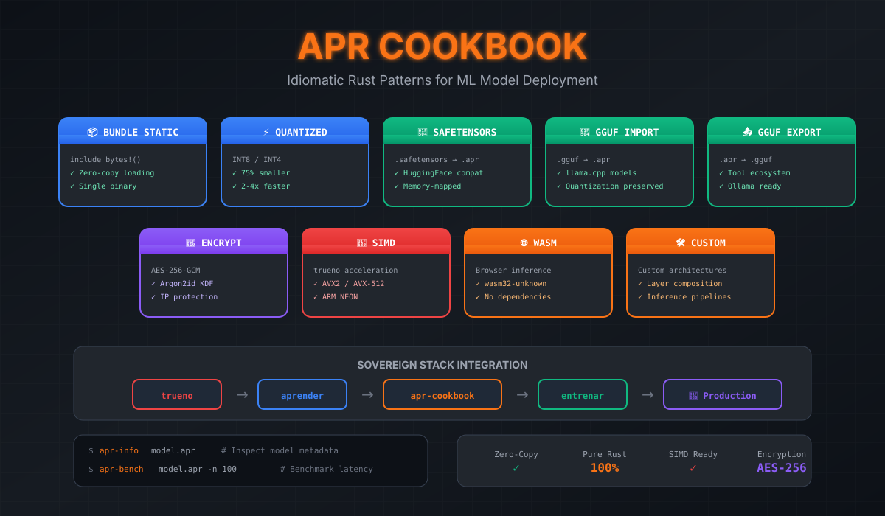

<p align="center">
  
</p>

<h1 align="center">apr-cookbook</h1>

<p align="center">
  <strong>The umbrella cookbook for the PAIML sovereign AI stack — model bundling, data loading, deployment-as-recipe, and visualization, all in pure Rust.</strong>
</p>

<p align="center">
  <em>v6.1.0 (2026-05-05) closes the <a href="docs/specifications/expand-cookbooks.md">expand-cookbooks</a> sprint: 44 new recipes covering Claude Code parity (<code>apr code</code>), GPU/CPU oracle bisection, MCP M5 transports, Anthropic Messages API drop-in, end-to-end publish, and 6 sister crates (<code>aprender-{mcp,tsp,shell,monte-carlo,cgp,contracts-macros}</code>). 420 recipes across 34 categories.</em>
</p>

<p align="center">
  <em>v6.0.0 (2026-05-05) consolidated sovereign-ai-cookbook, alimentar examples, and presentar examples into this repository per <a href="docs/specifications/centralize-cookbooks.md">centralize-cookbooks</a>. Source repositories archived 2026-05-05 (PMAT-070): <s><a href="https://github.com/paiml/sovereign-ai-cookbook">sovereign-ai-cookbook</a></s>, <s><a href="https://github.com/paiml/alimentar">alimentar</a></s>, <s><a href="https://github.com/paiml/presentar">presentar</a></s>. The alimentar and presentar Rust crates remain published on crates.io as <code>aprender-data</code> and <code>presentar</code> respectively.</em>
</p>

<p align="center">
  <a href="https://github.com/paiml/apr-cookbook/actions/workflows/ci.yml">
    
  </a>
  <a href="book/src/introduction.md">
    
  </a>
  <a href="LICENSE">
    
  </a>
  <a href="https://www.rust-lang.org/">
    
  </a>
</p>

<p align="center">
  <a href="#what-is-apr-cookbook">What</a> |
  <a href="#installation">Install</a> |
  <a href="#quick-start">Quick Start</a> |
  <a href="#examples">Examples</a> |
  <a href="#apr-v2-format">APR v2</a> |
  <a href="#sovereign-ai-stack">Stack</a> |
  <a href="#documentation">Docs</a>
</p>

---

## What is apr-cookbook?

341 executable examples across 25 categories covering the full ML
model lifecycle in pure Rust: creation, bundling, format conversion,
training, optimization, inference, serving, monitoring, and deployment
-- all built on the APR v2 model format with LZ4/ZSTD compression,
Int4/Int8 quantization, and Ed25519 signatures.

Every example compiles, runs, and includes unit tests. Device fallback
is automatic: GPU -> SIMD -> Scalar.

## Table of Contents

- [Installation](#installation)
- [Quick Start](#quick-start)
- [Examples](#examples)
- [APR v2 Format](#apr-v2-format)
- [Quality](#quality)
- [Sovereign AI Stack](#sovereign-ai-stack)
- [Live Demos](#live-demos)
- [Documentation](#documentation)
- [License](#license)

## Installation

```bash
git clone https://github.com/paiml/apr-cookbook.git
cd apr-cookbook
cargo build --examples
cargo test --all-features
```

Requires Rust 1.89+ (`rustup update stable`).

## Quick Start

```bash
# Create a model from scratch
cargo run --example create_apr_from_scratch

# Bundle for deployment
cargo run --example bundle_static_model

# Run the full optimization pipeline
cargo run --example optimize_full_pipeline

# List all 341 examples
cargo run --example 2>&1 | head -50
```

## Examples

| Category | Count | Description |
|----------|------:|-------------|
| [Analysis](examples/analysis/) | 64 | Inspect, validate, diff, bench, profile, QA gates, oracle, trace, lint, fingerprint |
| [CLI](examples/cli/) | 36 | apr-info, bench, convert, compile, serve, diff, tui, decrypt, diagnose, ptx-map |
| [Optimize](examples/optimize/) | 27 | LoRA, QLoRA, pruning, distillation, merge (SLERP/TIES/DARE), quantize |
| [Advanced](examples/advanced/) | 23 | RAG, CI/CD pipeline, A/B experiment, compliance audit, edge anomaly, style transfer |
| [Training](examples/training/) | 23 | Autograd, custom ops, gradient clipping, mixed-precision, curriculum, federated |
| [Format](examples/format/) | 20 | Rosetta convert/chain/verify, batch export, HF import, migration pipeline |
| [Lint](examples/lint/) | 18 | AWQ, GBNF, naming rules, DRY sampling, OOM, tool-use, validate-manifest |
| [Inference](examples/inference/) | 16 | Speculative decode, KV-cache, streaming tokens, mmap lazy load, ensemble, tool use |
| [GPU](examples/gpu/) | 14 | FlashAttention, CUDA, Vulkan/Intel Arc, tensor cores, multi-GPU, PTX analysis |
| [Monitoring](examples/monitoring/) | 12 | Explainability, audit trail, cost tracking, drift detection, RAPL energy, memory profiler |
| [Serving](examples/serve/) | 12 | HTTP server, A/B testing, canary deploy, rate limiting, selection router |
| [Bundling](examples/bundling/) | 9 | Static binary, quantized, encrypted, signed, Lambda package |
| [Registry](examples/registry/) | 8 | Versioning, lineage, comparison, rollback |
| [Acceleration](examples/acceleration/) | 7 | Autotuner, kernel fusion, mmap, quantized matmul, LZ4/ZSTD bench, cache tiling |
| [Creation](examples/creation/) | 7 | Linear regression, decision trees, clustering, neural networks, n-gram LM |
| [SIMD](examples/simd/) | 6 | trueno ops, AVX-VNNI Int8, matrix operations, vectorized inference |
| [WASM](examples/wasm/) | 6 | Browser inference, Web Workers, WebGPU, progressive loading, streaming compilation |
| [API](examples/api/) | 5 | REST inference, streaming, batch, auth middleware, health check |
| [Chat](examples/chat/) | 5 | ChatML, LLaMA 2, Mistral, multi-format, injection defense |
| [Conversion](examples/conversion/) | 5 | SafeTensors, GGUF, ONNX, Phi |
| [Distillation](examples/distillation/) | 5 | Knowledge transfer, attention transfer, layer matching, self-distillation |
| [Distributed](examples/distributed/) | 5 | Multi-node inference, sharding, ring-allreduce, pipeline parallel, gossip |
| [Serverless](examples/serverless/) | 5 | Lambda, cold start optimization, edge functions, containers, warmup |
| [Speech](examples/speech/) | 5 | Whisper transcription, streaming ASR, VAD, diarization, multilingual |
| [MCP](examples/mcp/) | 3 | Stdio server, HTTP server, tool schema advertisement |

**Total: 341 recipes.** Run any example: `cargo run --example <name>`

**Demo-run baseline (2026-04-23):** 330 / 341 pass under 10s; the remaining 11 are compute-heavy benchmarks (see `docs/specifications/components/quality-gates.md#demo-run-baseline`) that require a longer timeout. 0 failures.

### Full recipe table

<!-- RECIPE-TABLE-START -->
<!-- Auto-generated by scripts/generate-recipe-table.sh — do not edit manually -->
<!-- Re-generate: ./scripts/generate-recipe-table.sh --update -->
<!-- CI validates: recipe-table workflow ensures this table matches source -->

**1513 recipes** | Build: [](https://github.com/paiml/apr-cookbook/actions/workflows/ci.yml)

<details>
<summary>Full recipe table (click to expand)</summary>

| # | Example | Category | Devices | Build |
|--:|---------|----------|---------|:-----:|
| 1 | `acceleration_arithmetic_intensity` | acceleration |  | ✅ |
| 2 | `acceleration_autotuner` | acceleration |  | ✅ |
| 3 | `acceleration_cache_tiling` | acceleration |  | ✅ |
| 4 | `acceleration_compression_benchmark` | acceleration |  | ✅ |
| 5 | `acceleration_kernel_dispatch_planner` | acceleration |  | ✅ |
| 6 | `acceleration_kernel_fusion` | acceleration |  | ✅ |
| 7 | `acceleration_mmap_inference` | acceleration |  | ✅ |
| 8 | `acceleration_mmap_per_tensor_diff_bench` | acceleration |  | ✅ |
| 9 | `acceleration_moe_rayon_dispatch_bench` | acceleration |  | ✅ |
| 10 | `acceleration_quantized_matmul` | acceleration |  | ✅ |
| 11 | `acceleration_thread_pool_sizer` | acceleration |  | ✅ |
| 12 | `simd_matrix_operations` | acceleration |    | ✅ |
| 13 | `ab_experiment` | advanced |  | ✅ |
| 14 | `adv_admission_quota_per_tenant` | advanced |  | ✅ |
| 15 | `adv_canary_promotion_gate` | advanced |  | ✅ |
| 16 | `adv_capability_manifest_validator` | advanced |  | ✅ |
| 17 | `adv_chain_of_thought` | advanced |  | ✅ |
| 18 | `adv_chunked_prefill` | advanced |  | ✅ |
| 19 | `adv_chunked_response_buffer` | advanced |  | ✅ |
| 20 | `adv_circuit_breaker` | advanced |  | ✅ |
| 21 | `adv_continuous_batching` | advanced |  | ✅ |
| 22 | `adv_correlation_id_propagator` | advanced |  | ✅ |
| 23 | `adv_idempotency_key` | advanced |  | ✅ |
| 24 | `adv_iiur_compliance_scorer` | advanced |  | ✅ |
| 25 | `adv_kv_cache_eviction` | advanced |  | ✅ |
| 26 | `adv_kv_quantization` | advanced |  | ✅ |
| 27 | `adv_long_context_retrieval_split` | advanced |  | ✅ |
| 28 | `adv_multimodal_router` | advanced |  | ✅ |
| 29 | `adv_payload_size_limit` | advanced |  | ✅ |
| 30 | `adv_pipeline_dag` | advanced |  | ✅ |
| 31 | `adv_priority_queue_eviction` | advanced |  | ✅ |
| 32 | `adv_provenance_chain` | advanced |  | ✅ |
| 33 | `adv_quantize_pipeline` | advanced |  | ✅ |
| 34 | `adv_quota_token_bucket` | advanced |  | ✅ |
| 35 | `adv_recipe_dependency_dag` | advanced |  | ✅ |
| 36 | `adv_replica_failover` | advanced |  | ✅ |
| 37 | `adv_request_coalescing` | advanced |  | ✅ |
| 38 | `adv_request_dedup_cache` | advanced |  | ✅ |
| 39 | `adv_request_id_format` | advanced |  | ✅ |
| 40 | `adv_request_priority_aging` | advanced |  | ✅ |
| 41 | `adv_request_priority_router` | advanced |  | ✅ |
| 42 | `adv_response_compression_picker` | advanced |  | ✅ |
| 43 | `adv_response_diff_validator` | advanced |  | ✅ |
| 44 | `adv_response_redactor` | advanced |  | ✅ |
| 45 | `adv_response_schema_match` | advanced |  | ✅ |
| 46 | `adv_retry_backoff` | advanced |  | ✅ |
| 47 | `adv_safety_classifier_threshold` | advanced |  | ✅ |
| 48 | `adv_session_affinity_router` | advanced |  | ✅ |
| 49 | `adv_speculative_decode_window` | advanced |  | ✅ |
| 50 | `adv_speculative_tree_attention` | advanced |  | ✅ |
| 51 | `adv_token_budget` | advanced |  | ✅ |
| 52 | `adv_tool_call_validator` | advanced |  | ✅ |
| 53 | `adv_warmup_classifier` | advanced |  | ✅ |
| 54 | `cicd_model_pipeline` | advanced |  | ✅ |
| 55 | `clip_search` | advanced |  | ✅ |
| 56 | `code_defect_oracle` | advanced |  | ✅ |
| 57 | `compliance_audit` | advanced |  | ✅ |
| 58 | `debug_fix_loop` | advanced |  | ✅ |
| 59 | `edge_anomaly_detection` | advanced |  | ✅ |
| 60 | `embedding_visualization` | advanced |  | ✅ |
| 61 | `handwriting_recognition` | advanced |  | ✅ |
| 62 | `hierarchical_cache_benchmark` | advanced |  | ✅ |
| 63 | `image_classification` | advanced |  | ✅ |
| 64 | `model_inspection_scoring` | advanced |  | ✅ |
| 65 | `model_showcase` | advanced |  | ✅ |
| 66 | `online_training_defect` | advanced |  | ✅ |
| 67 | `quantization_quality_tradeoff` | advanced |  | ✅ |
| 68 | `rag_pipeline` | advanced |  | ✅ |
| 69 | `showcase_gallery` | advanced |  | ✅ |
| 70 | `showcase_markdown` | advanced |  | ✅ |
| 71 | `spanish_tutor` | advanced |  | ✅ |
| 72 | `streaming_sentiment` | advanced |  | ✅ |
| 73 | `style_transfer` | advanced |  | ✅ |
| 74 | `voice_recognition` | advanced |  | ✅ |
| 75 | `wasm_summarizer` | advanced |  | ✅ |
| 76 | `analysis_bench` | analysis |  | ✅ |
| 77 | `analysis_canary` | analysis |  | ✅ |
| 78 | `analysis_check` | analysis |  | ✅ |
| 79 | `analysis_compare_hf` | analysis |  | ✅ |
| 80 | `analysis_compare_hf_threshold` | analysis |  | ✅ |
| 81 | `analysis_contract_algorithm_binding_pattern` | analysis |  | ✅ |
| 82 | `analysis_cpu_vs_gpu_parity_gate` | analysis |   | ✅ |
| 83 | `analysis_debug` | analysis |  | ✅ |
| 84 | `analysis_diff` | analysis |  | ✅ |
| 85 | `analysis_eval` | analysis |  | ✅ |
| 86 | `analysis_explain` | analysis |  | ✅ |
| 87 | `analysis_flow` | analysis |  | ✅ |
| 88 | `analysis_hex` | analysis |  | ✅ |
| 89 | `analysis_inspect` | analysis |  | ✅ |
| 90 | `analysis_json_schema_draft7_meta_validation` | analysis |  | ✅ |
| 91 | `analysis_latency_breakdown` | analysis |  | ✅ |
| 92 | `analysis_lint` | analysis |  | ✅ |
| 93 | `analysis_memory_leak_detector` | analysis |  | ✅ |
| 94 | `analysis_model_fingerprint` | analysis |  | ✅ |
| 95 | `analysis_oracle` | analysis |  | ✅ |
| 96 | `analysis_p99_throughput_gate` | analysis |  | ✅ |
| 97 | `analysis_parity` | analysis |  | ✅ |
| 98 | `analysis_probar` | analysis |  | ✅ |
| 99 | `analysis_profile` | analysis |  | ✅ |
| 100 | `analysis_pv_check_parity_authoring` | analysis |  | ✅ |
| 101 | `analysis_qa_capability` | analysis |  | ✅ |
| 102 | `analysis_qa_gates` | analysis |  | ✅ |
| 103 | `analysis_qa_report` | analysis |  | ✅ |
| 104 | `analysis_qualify` | analysis |  | ✅ |
| 105 | `analysis_slice` | analysis |  | ✅ |
| 106 | `analysis_tensors` | analysis |  | ✅ |
| 107 | `analysis_tensors_stats` | analysis |  | ✅ |
| 108 | `analysis_trace` | analysis |  | ✅ |
| 109 | `analysis_tree` | analysis |  | ✅ |
| 110 | `analysis_validate` | analysis |  | ✅ |
| 111 | `bench_batch_sweep` | analysis |  | ✅ |
| 112 | `bench_quantization_compare` | analysis |  | ✅ |
| 113 | `canary_regression` | analysis |  | ✅ |
| 114 | `canary_rolling_window` | analysis |  | ✅ |
| 115 | `check_batch` | analysis |  | ✅ |
| 116 | `check_json_report` | analysis |  | ✅ |
| 117 | `debug_activation_dist` | analysis |  | ✅ |
| 118 | `debug_nan_trace` | analysis |  | ✅ |
| 119 | `eval_benchmark_suite` | analysis |  | ✅ |
| 120 | `eval_pass_at_k` | analysis |  | ✅ |
| 121 | `experiment_ab_test` | analysis |  | ✅ |
| 122 | `experiment_multi_seed` | analysis |  | ✅ |
| 123 | `explain_error_codes` | analysis |  | ✅ |
| 124 | `explain_shape_mismatch` | analysis |  | ✅ |
| 125 | `flow_arch_diff` | analysis |  | ✅ |
| 126 | `flow_depth_sweep` | analysis |  | ✅ |
| 127 | `hex_diff` | analysis |  | ✅ |
| 128 | `hex_pattern_search` | analysis |  | ✅ |
| 129 | `inspect_layer_params` | analysis |  | ✅ |
| 130 | `inspect_quantization_stats` | analysis |  | ✅ |
| 131 | `lint_naming_rules` | analysis |  | ✅ |
| 132 | `lint_suppression` | analysis |  | ✅ |
| 133 | `oracle_classifier` | analysis |  | ✅ |
| 134 | `oracle_ensemble_vote` | analysis |  | ✅ |
| 135 | `parity_format` | analysis |  | ✅ |
| 136 | `parity_quantization` | analysis |  | ✅ |
| 137 | `probar_regression_diff` | analysis |  | ✅ |
| 138 | `probar_suite_runner` | analysis |  | ✅ |
| 139 | `profile_memory_layers` | analysis |  | ✅ |
| 140 | `profile_roofline` | analysis |  | ✅ |
| 141 | `qualify_remediation` | analysis |  | ✅ |
| 142 | `qualify_scorecard` | analysis |  | ✅ |
| 143 | `trace_per_op_latency` | analysis |  | ✅ |
| 144 | `trace_run_diff` | analysis |  | ✅ |
| 145 | `tree_arch_diff` | analysis |  | ✅ |
| 146 | `tree_param_rollup` | analysis |  | ✅ |
| 147 | `api_admission_control_queue` | api |  | ✅ |
| 148 | `api_auth_middleware` | api |  | ✅ |
| 149 | `api_batch_inference` | api |  | ✅ |
| 150 | `api_call_model_inference` | api |  | ✅ |
| 151 | `api_circuit_breaker_state` | api |  | ✅ |
| 152 | `api_idempotency_key_dedup` | api |  | ✅ |
| 153 | `api_model_health_check` | api |  | ✅ |
| 154 | `api_oauth_token_refresh_window` | api |  | ✅ |
| 155 | `api_request_id_correlation` | api |  | ✅ |
| 156 | `api_request_timeout_classifier` | api |  | ✅ |
| 157 | `api_response_cache_ttl` | api |  | ✅ |
| 158 | `api_streaming_chunk_size` | api |  | ✅ |
| 159 | `api_streaming_inference` | api |  | ✅ |
| 160 | `api_token_bucket_rate_limiter` | api |  | ✅ |
| 161 | `bundle_apr_lambda_package` | bundling |  | ✅ |
| 162 | `bundle_apr_quantized_q4` | bundling |  | ✅ |
| 163 | `bundle_apr_signed` | bundling |  | ✅ |
| 164 | `bundle_apr_static_binary` | bundling |  | ✅ |
| 165 | `bundle_cache_key_deriver` | bundling |  | ✅ |
| 166 | `bundle_compression_picker` | bundling |  | ✅ |
| 167 | `bundle_compression_ratio_calc` | bundling |  | ✅ |
| 168 | `bundle_encrypted_model` | bundling |  | ✅ |
| 169 | `bundle_integrity_checksum` | bundling |  | ✅ |
| 170 | `bundle_manifest_header_validator` | bundling |  | ✅ |
| 171 | `bundle_metadata_versioning` | bundling |  | ✅ |
| 172 | `bundle_mmap_offset_calculator` | bundling |  | ✅ |
| 173 | `bundle_partial_load` | bundling |  | ✅ |
| 174 | `bundle_pre_load_warmup` | bundling |  | ✅ |
| 175 | `bundle_quantized_model` | bundling |  | ✅ |
| 176 | `bundle_signing_attestation` | bundling |  | ✅ |
| 177 | `bundle_signing_chain_builder` | bundling |  | ✅ |
| 178 | `bundle_static_model` | bundling |  | ✅ |
| 179 | `bundle_streaming_q4k_large_model` | bundling |  | ✅ |
| 180 | `bundle_streaming_unpack` | bundling |  | ✅ |
| 181 | `bundle_table_of_contents` | bundling |  | ✅ |
| 182 | `bundle_tensor_dedup` | bundling |  | ✅ |
| 183 | `bundle_zero_copy_handoff` | bundling |  | ✅ |
| 184 | `encrypt_kdf_sweep` | bundling |  | ✅ |
| 185 | `encrypt_signed` | bundling |  | ✅ |
| 186 | `cgp_baseline_diff_classifier` | cgp |  | ✅ |
| 187 | `cgp_kernel_metric_aggregator` | cgp |  | ✅ |
| 188 | `cgp_proof_status_dispatcher` | cgp |  | ✅ |
| 189 | `cgp_regression_detector_baseline_vs_current` | cgp |  | ✅ |
| 190 | `cgp_roofline_classify_kernel` | cgp |  | ✅ |
| 191 | `cgp_roofline_ridge_point_per_precision` | cgp |  | ✅ |
| 192 | `chat_chatml` | chat |  | ✅ |
| 193 | `chat_injection_defense` | chat |  | ✅ |
| 194 | `chat_llama2` | chat |  | ✅ |
| 195 | `chat_mistral` | chat |  | ✅ |
| 196 | `chat_multi_format` | chat |  | ✅ |
| 197 | `chat_role_state_machine` | chat |  | ✅ |
| 198 | `chat_template_renderer` | chat |  | ✅ |
| 199 | `chat_token_budget_truncation` | chat |  | ✅ |
| 200 | `apr_bench` | cli |  | ✅ |
| 201 | `apr_info` | cli |  | ✅ |
| 202 | `cli_apr_bench` | cli |  | ✅ |
| 203 | `cli_apr_compile` | cli |  | ✅ |
| 204 | `cli_apr_convert` | cli |  | ✅ |
| 205 | `cli_apr_decrypt` | cli |  | ✅ |
| 206 | `cli_apr_diagnose` | cli |  | ✅ |
| 207 | `cli_apr_diff` | cli |  | ✅ |
| 208 | `cli_apr_info` | cli |  | ✅ |
| 209 | `cli_apr_list` | cli |  | ✅ |
| 210 | `cli_apr_ptx_map` | cli |  | ✅ |
| 211 | `cli_apr_rm` | cli |  | ✅ |
| 212 | `cli_apr_runs` | cli |  | ✅ |
| 213 | `cli_apr_serve` | cli |  | ✅ |
| 214 | `cli_apr_tokenize` | cli |  | ✅ |
| 215 | `cli_apr_tui` | cli |  | ✅ |
| 216 | `cli_bench_batch_sweep_planner` | cli |  | ✅ |
| 217 | `cli_bench_cv_stability_gate` | cli |  | ✅ |
| 218 | `cli_bench_h12_throughput_gate` | cli |  | ✅ |
| 219 | `cli_bench_percentiles_csv_parser` | cli |  | ✅ |
| 220 | `cli_bench_unit_normalizer` | cli |  | ✅ |
| 221 | `cli_bench_warmup_iterations_envelope` | cli |  | ✅ |
| 222 | `cli_canary_check_verdict` | cli |  | ✅ |
| 223 | `cli_canary_create_envelope` | cli |  | ✅ |
| 224 | `cli_canary_directory_layout` | cli |  | ✅ |
| 225 | `cli_cbtop_ci_threshold_gate` | cli |  | ✅ |
| 226 | `cli_cbtop_headless_json_schema` | cli |  | ✅ |
| 227 | `cli_cbtop_speculative_decoding_envelope` | cli |  | ✅ |
| 228 | `cli_check_json_output_schema` | cli |  | ✅ |
| 229 | `cli_check_pipeline_integrity_smoke` | cli |  | ✅ |
| 230 | `cli_check_skip_contract_diagnostic` | cli |  | ✅ |
| 231 | `cli_compare_hf_offline_safety` | cli |  | ✅ |
| 232 | `cli_compare_hf_tensor_filter` | cli |  | ✅ |
| 233 | `cli_compare_hf_threshold_gate` | cli |  | ✅ |
| 234 | `cli_compile_optimization_flags` | cli |  | ✅ |
| 235 | `cli_compile_output_path_resolver` | cli |  | ✅ |
| 236 | `cli_compile_target_triple_validator` | cli |  | ✅ |
| 237 | `cli_data_balance_strategy_picker` | cli |  | ✅ |
| 238 | `cli_data_decontaminate_ngram_overlap` | cli |  | ✅ |
| 239 | `cli_data_split_stratified_ratios` | cli |  | ✅ |
| 240 | `cli_debug_breakpoint_planner` | cli |  | ✅ |
| 241 | `cli_debug_drama_classifier` | cli |  | ✅ |
| 242 | `cli_debug_layer_glob_matcher` | cli |  | ✅ |
| 243 | `cli_debug_limit_truncator` | cli |  | ✅ |
| 244 | `cli_debug_string_extractor` | cli |  | ✅ |
| 245 | `cli_debug_tensor_diff_tolerance` | cli |  | ✅ |
| 246 | `cli_decrypt_aead_tag_verification` | cli |  | ✅ |
| 247 | `cli_decrypt_invocation_envelope` | cli |  | ✅ |
| 248 | `cli_decrypt_key_format_validation` | cli |  | ✅ |
| 249 | `cli_decrypt_key_rotation_grace` | cli |  | ✅ |
| 250 | `cli_decrypt_output_collision_detector` | cli |  | ✅ |
| 251 | `cli_decrypt_verify_ordering` | cli |  | ✅ |
| 252 | `cli_diagnose_five_whys_chain` | cli |  | ✅ |
| 253 | `cli_diagnose_grad_nan_scanner` | cli |  | ✅ |
| 254 | `cli_diagnose_jsonl_corpus_validator` | cli |  | ✅ |
| 255 | `cli_diagnose_model_size_inference` | cli |  | ✅ |
| 256 | `cli_diagnose_param_count_sanity` | cli |  | ✅ |
| 257 | `cli_diagnose_weight_histogram_classifier` | cli |  | ✅ |
| 258 | `cli_diff_magnitude_classifier` | cli |  | ✅ |
| 259 | `cli_diff_shape_compatibility` | cli |  | ✅ |
| 260 | `cli_diff_structural_renderer` | cli |  | ✅ |
| 261 | `cli_diff_values_aprt_stage` | cli |  | ✅ |
| 262 | `cli_distill_ensemble_weighter` | cli |  | ✅ |
| 263 | `cli_distill_layer_pairer` | cli |  | ✅ |
| 264 | `cli_distill_loss_combiner` | cli |  | ✅ |
| 265 | `cli_distill_stage_dispatcher` | cli |  | ✅ |
| 266 | `cli_distill_strategy_dispatcher` | cli |  | ✅ |
| 267 | `cli_distill_temperature_alpha_band` | cli |  | ✅ |
| 268 | `cli_encrypt_aad_envelope` | cli |  | ✅ |
| 269 | `cli_encrypt_force_overwrite_policy` | cli |  | ✅ |
| 270 | `cli_encrypt_kdf_iterations_validator` | cli |  | ✅ |
| 271 | `cli_encrypt_keystream_envelope` | cli |  | ✅ |
| 272 | `cli_encrypt_nonce_uniqueness_checker` | cli |  | ✅ |
| 273 | `cli_encrypt_passphrase_strength` | cli |  | ✅ |
| 274 | `cli_eval_bleu_score_classifier` | cli |  | ✅ |
| 275 | `cli_eval_dataset_dispatcher` | cli |  | ✅ |
| 276 | `cli_eval_metric_dispatcher` | cli |  | ✅ |
| 277 | `cli_eval_pass_at_k_temperature_pairing` | cli |  | ✅ |
| 278 | `cli_eval_perplexity_threshold_gate` | cli |  | ✅ |
| 279 | `cli_eval_top_k_accuracy_gate` | cli |  | ✅ |
| 280 | `cli_experiment_hypothesis_envelope` | cli |  | ✅ |
| 281 | `cli_experiment_metric_compare_gate` | cli |  | ✅ |
| 282 | `cli_experiment_param_diff_renderer` | cli |  | ✅ |
| 283 | `cli_experiment_run_id_collision` | cli |  | ✅ |
| 284 | `cli_experiment_view_loss_curve_render` | cli |  | ✅ |
| 285 | `cli_experiment_view_run_filter` | cli |  | ✅ |
| 286 | `cli_explain_ablation_envelope` | cli |  | ✅ |
| 287 | `cli_explain_error_code_lookup` | cli |  | ✅ |
| 288 | `cli_explain_ig_steps_validator` | cli |  | ✅ |
| 289 | `cli_explain_kernel_dispatch_pipeline` | cli |  | ✅ |
| 290 | `cli_explain_proof_status_aggregator` | cli |  | ✅ |
| 291 | `cli_explain_saliency_rank_classifier` | cli |  | ✅ |
| 292 | `cli_export_batch_csv_planner` | cli |  | ✅ |
| 293 | `cli_export_format_allowlist` | cli |  | ✅ |
| 294 | `cli_export_opset_compat_matrix` | cli |  | ✅ |
| 295 | `cli_export_output_naming_pattern` | cli |  | ✅ |
| 296 | `cli_export_plan_mode_envelope` | cli |  | ✅ |
| 297 | `cli_export_target_dtype_validator` | cli |  | ✅ |
| 298 | `cli_finetune_checkpoint_format_csv` | cli |  | ✅ |
| 299 | `cli_finetune_grad_accum_budget` | cli |  | ✅ |
| 300 | `cli_finetune_lora_rank_picker` | cli |  | ✅ |
| 301 | `cli_finetune_lr_scheduler_picker` | cli |  | ✅ |
| 302 | `cli_finetune_merge_mode_envelope` | cli |  | ✅ |
| 303 | `cli_finetune_method_picker` | cli |  | ✅ |
| 304 | `cli_flow_component_filter` | cli |  | ✅ |
| 305 | `cli_flow_dot_renderer` | cli |  | ✅ |
| 306 | `cli_flow_layer_aggregation` | cli |  | ✅ |
| 307 | `cli_gpu_device_capability_filter` | cli |  | ✅ |
| 308 | `cli_gpu_fp8_capability_checker` | cli |  | ✅ |
| 309 | `cli_gpu_nccl_strategy_picker` | cli |  | ✅ |
| 310 | `cli_gpu_oom_recovery_advisor` | cli |  | ✅ |
| 311 | `cli_gpu_peer_access_topology` | cli |  | ✅ |
| 312 | `cli_gpu_vram_reservation_planner` | cli |  | ✅ |
| 313 | `cli_hex_offset_parser` | cli |  | ✅ |
| 314 | `cli_hex_slice_range_parser` | cli |  | ✅ |
| 315 | `cli_hex_view_mode_dispatcher` | cli |  | ✅ |
| 316 | `cli_import_dtype_coercion_validator` | cli |  | ✅ |
| 317 | `cli_import_format_auto_detector` | cli |  | ✅ |
| 318 | `cli_import_no_config_inference_risk` | cli |  | ✅ |
| 319 | `cli_import_provenance_chain_enforcement` | cli |  | ✅ |
| 320 | `cli_import_sharding_plan_validator` | cli |  | ✅ |
| 321 | `cli_import_strict_mode_envelope` | cli |  | ✅ |
| 322 | `cli_inspect_view_mode_dispatcher` | cli |  | ✅ |
| 323 | `cli_inspect_vocab_token_query` | cli |  | ✅ |
| 324 | `cli_inspect_weight_stats_aggregator` | cli |  | ✅ |
| 325 | `cli_mcp_batch_request_envelope` | cli |  | ✅ |
| 326 | `cli_mcp_error_response_codes` | cli |  | ✅ |
| 327 | `cli_mcp_jsonrpc_request_validator` | cli |  | ✅ |
| 328 | `cli_mcp_resource_uri_scheme` | cli |  | ✅ |
| 329 | `cli_mcp_tool_manifest_envelope` | cli |  | ✅ |
| 330 | `cli_mcp_transport_dispatcher` | cli |  | ✅ |
| 331 | `cli_merge_dare_drop_rate_band` | cli |  | ✅ |
| 332 | `cli_merge_signed_conflict_resolver` | cli |  | ✅ |
| 333 | `cli_merge_slerp_t_clamp` | cli |  | ✅ |
| 334 | `cli_merge_strategy_dispatcher` | cli |  | ✅ |
| 335 | `cli_merge_ties_density_gate` | cli |  | ✅ |
| 336 | `cli_merge_weights_csv_parser` | cli |  | ✅ |
| 337 | `cli_monitor_drift_threshold_gate` | cli |  | ✅ |
| 338 | `cli_monitor_format_dispatcher` | cli |  | ✅ |
| 339 | `cli_monitor_log_rotation_budget` | cli |  | ✅ |
| 340 | `cli_monitor_metrics_envelope` | cli |  | ✅ |
| 341 | `cli_monitor_quantile_picker` | cli |  | ✅ |
| 342 | `cli_monitor_refresh_throttle` | cli |  | ✅ |
| 343 | `cli_ollama_chat_lint_eval_count_consistency` | cli |  | ✅ |
| 344 | `cli_ollama_chat_lint_message_content_validation` | cli |  | ✅ |
| 345 | `cli_ollama_chat_lint_role_state_machine` | cli |  | ✅ |
| 346 | `cli_ollama_embed_dim_validator` | cli |  | ✅ |
| 347 | `cli_ollama_model_name_parser` | cli |  | ✅ |
| 348 | `cli_ollama_token_rate_gate` | cli |  | ✅ |
| 349 | `cli_oracle_compliance_gate` | cli |  | ✅ |
| 350 | `cli_oracle_family_introspection` | cli |  | ✅ |
| 351 | `cli_oracle_size_constraint_filter` | cli |  | ✅ |
| 352 | `cli_parity_assert_mode_exit_codes` | cli |  | ✅ |
| 353 | `cli_parity_default_prompt_envelope` | cli |  | ✅ |
| 354 | `cli_parity_token_divergence_classifier` | cli |  | ✅ |
| 355 | `cli_pipeline_concurrency_limiter` | cli |  | ✅ |
| 356 | `cli_pipeline_dag_topological_sort` | cli |  | ✅ |
| 357 | `cli_pipeline_retry_policy_envelope` | cli |  | ✅ |
| 358 | `cli_pipeline_stage_skip_predicate` | cli |  | ✅ |
| 359 | `cli_pipeline_status_state_machine` | cli |  | ✅ |
| 360 | `cli_pipeline_validate_manifest_schema` | cli |  | ✅ |
| 361 | `cli_pretrain_curriculum_validator` | cli |  | ✅ |
| 362 | `cli_pretrain_divergence_guard` | cli |  | ✅ |
| 363 | `cli_pretrain_epoch_budget_calc` | cli |  | ✅ |
| 364 | `cli_pretrain_grad_clip_threshold` | cli |  | ✅ |
| 365 | `cli_pretrain_mode_dispatcher` | cli |  | ✅ |
| 366 | `cli_pretrain_run_dir_layout` | cli |  | ✅ |
| 367 | `cli_probar_export_envelope` | cli |  | ✅ |
| 368 | `cli_probar_golden_diff` | cli |  | ✅ |
| 369 | `cli_probar_layer_pattern_filter` | cli |  | ✅ |
| 370 | `cli_profile_flame_depth_limit` | cli |  | ✅ |
| 371 | `cli_profile_format_dispatcher` | cli |  | ✅ |
| 372 | `cli_profile_hot_function_classifier` | cli |  | ✅ |
| 373 | `cli_profile_naive_detection_threshold` | cli |  | ✅ |
| 374 | `cli_profile_perf_grade_thresholds` | cli |  | ✅ |
| 375 | `cli_profile_sampling_rate_budget` | cli |  | ✅ |
| 376 | `cli_prune_lottery_ticket_warmup` | cli |  | ✅ |
| 377 | `cli_prune_method_validator` | cli |  | ✅ |
| 378 | `cli_prune_remove_layers_parser` | cli |  | ✅ |
| 379 | `cli_prune_sparsity_ramp_validator` | cli |  | ✅ |
| 380 | `cli_prune_target_ratio_band` | cli |  | ✅ |
| 381 | `cli_prune_wanda_activation_scorer` | cli |  | ✅ |
| 382 | `cli_ptx_kernel_name_parser` | cli |  | ✅ |
| 383 | `cli_ptx_map_kernel_filter` | cli |  | ✅ |
| 384 | `cli_ptx_map_prefill_vs_decode` | cli |  | ✅ |
| 385 | `cli_ptx_map_reverse_lookup` | cli |  | ✅ |
| 386 | `cli_ptx_register_pressure_threshold` | cli |  | ✅ |
| 387 | `cli_ptx_strict_mode_whitelist` | cli |  | ✅ |
| 388 | `cli_publish_dry_run_diff` | cli |  | ✅ |
| 389 | `cli_publish_manifest_full` | cli |  | ✅ |
| 390 | `cli_publish_parent_chain_termination` | cli |  | ✅ |
| 391 | `cli_publish_pipeline_tag_allowlist` | cli |  | ✅ |
| 392 | `cli_publish_repo_id_validator` | cli |  | ✅ |
| 393 | `cli_pull_alias_resolver` | cli |  | ✅ |
| 394 | `cli_pull_dataset_glob_filter` | cli |  | ✅ |
| 395 | `cli_pull_revision_pin_resolver` | cli |  | ✅ |
| 396 | `cli_qa_assertion_envelope` | cli |  | ✅ |
| 397 | `cli_qa_parallel_test_budget` | cli |  | ✅ |
| 398 | `cli_qa_regression_delta_classifier` | cli |  | ✅ |
| 399 | `cli_qa_safetensors_parity_required` | cli |  | ✅ |
| 400 | `cli_qa_tier_aggregator` | cli |  | ✅ |
| 401 | `cli_qa_warmup_iteration_budget` | cli |  | ✅ |
| 402 | `cli_qualify_skip_list_filter` | cli |  | ✅ |
| 403 | `cli_qualify_tier_progression` | cli |  | ✅ |
| 404 | `cli_qualify_timeout_budget` | cli |  | ✅ |
| 405 | `cli_quantize_batch_csv_planner` | cli |  | ✅ |
| 406 | `cli_quantize_calibration_budget` | cli |  | ✅ |
| 407 | `cli_quantize_format_compatibility` | cli |  | ✅ |
| 408 | `cli_quantize_mixed_precision_selector` | cli |  | ✅ |
| 409 | `cli_quantize_scale_zero_point_validator` | cli |  | ✅ |
| 410 | `cli_quantize_scheme_size_predictor` | cli |  | ✅ |
| 411 | `cli_registry_aliases_collision_detection` | cli |  | ✅ |
| 412 | `cli_registry_aliases_json_envelope` | cli |  | ✅ |
| 413 | `cli_registry_aliases_yaml_loader` | cli |  | ✅ |
| 414 | `cli_registry_lineage_cycle_detector` | cli |  | ✅ |
| 415 | `cli_registry_semver_tag_matcher` | cli |  | ✅ |
| 416 | `cli_registry_uri_parser` | cli |  | ✅ |
| 417 | `cli_rosetta_chain_planner` | cli |  | ✅ |
| 418 | `cli_rosetta_compare_inference_envelope` | cli |  | ✅ |
| 419 | `cli_rosetta_compare_inference_logit_diff` | cli |  | ✅ |
| 420 | `cli_rosetta_compare_inference_temperature_modes` | cli |  | ✅ |
| 421 | `cli_rosetta_convert_extension_inference` | cli |  | ✅ |
| 422 | `cli_rosetta_convert_external_tokenizer` | cli |  | ✅ |
| 423 | `cli_rosetta_convert_quantize_envelope` | cli |  | ✅ |
| 424 | `cli_rosetta_diff_tensors_layout_check` | cli |  | ✅ |
| 425 | `cli_rosetta_diff_tensors_pad_token_signal` | cli |  | ✅ |
| 426 | `cli_rosetta_diff_tensors_value_sampler` | cli |  | ✅ |
| 427 | `cli_rosetta_fingerprint_diff_mode` | cli |  | ✅ |
| 428 | `cli_rosetta_fingerprint_filter_pattern` | cli |  | ✅ |
| 429 | `cli_rosetta_fingerprint_json_envelope` | cli |  | ✅ |
| 430 | `cli_rosetta_fingerprint_stats` | cli |  | ✅ |
| 431 | `cli_rosetta_inspect_format_detector` | cli |  | ✅ |
| 432 | `cli_rosetta_inspect_hexdump_window` | cli |  | ✅ |
| 433 | `cli_rosetta_inspect_tensor_table` | cli |  | ✅ |
| 434 | `cli_rosetta_round_trip_verify` | cli |  | ✅ |
| 435 | `cli_rosetta_validate_stats_per_tensor_report` | cli |  | ✅ |
| 436 | `cli_rosetta_validate_stats_reference_or_fingerprints` | cli |  | ✅ |
| 437 | `cli_rosetta_validate_stats_threshold_gate` | cli |  | ✅ |
| 438 | `cli_runs_diff_two_runs` | cli |  | ✅ |
| 439 | `cli_runs_ls_sparkline_renderer` | cli |  | ✅ |
| 440 | `cli_runs_show_metric_summary` | cli |  | ✅ |
| 441 | `cli_serve_kv_cache_budget` | cli |  | ✅ |
| 442 | `cli_serve_max_tokens_cap` | cli |  | ✅ |
| 443 | `cli_serve_plan_capacity_estimator` | cli |  | ✅ |
| 444 | `cli_serve_run_endpoint_router` | cli |  | ✅ |
| 445 | `cli_serve_run_port_validator` | cli |  | ✅ |
| 446 | `cli_serve_streaming_chunk_size` | cli |  | ✅ |
| 447 | `cli_showcase_runs_floor_enforcement` | cli |  | ✅ |
| 448 | `cli_showcase_step_dispatcher` | cli |  | ✅ |
| 449 | `cli_showcase_tier_baseline_matrix` | cli |  | ✅ |
| 450 | `cli_stamp_preserves_tensor_bytes` | cli |  | ✅ |
| 451 | `cli_stamp_provenance_basic` | cli |  | ✅ |
| 452 | `cli_stamp_spdx_validation` | cli |  | ✅ |
| 453 | `cli_tensors_filter_pattern` | cli |  | ✅ |
| 454 | `cli_tensors_limit_truncator` | cli |  | ✅ |
| 455 | `cli_tensors_stats_aggregator` | cli |  | ✅ |
| 456 | `cli_tokenize_corpus_shard_planner` | cli |  | ✅ |
| 457 | `cli_tokenize_hf_import_validation` | cli |  | ✅ |
| 458 | `cli_tokenize_plan_estimator` | cli |  | ✅ |
| 459 | `cli_trace_diff_mode_envelope` | cli |  | ✅ |
| 460 | `cli_trace_save_tensor_layer0` | cli |  | ✅ |
| 461 | `cli_trace_save_tensor_layer_range` | cli |  | ✅ |
| 462 | `cli_trace_stage_csv_dispatcher` | cli |  | ✅ |
| 463 | `cli_train_checkpoint_planner` | cli |  | ✅ |
| 464 | `cli_train_early_stop_patience` | cli |  | ✅ |
| 465 | `cli_train_halving_round_planner` | cli |  | ✅ |
| 466 | `cli_train_lr_finder_validator` | cli |  | ✅ |
| 467 | `cli_train_sweep_grid_generator` | cli |  | ✅ |
| 468 | `cli_train_watch_restart_policy` | cli |  | ✅ |
| 469 | `cli_tui_color_theme_dispatcher` | cli |  | ✅ |
| 470 | `cli_tui_keybinding_matcher` | cli |  | ✅ |
| 471 | `cli_tui_pager_buffer_planner` | cli |  | ✅ |
| 472 | `cli_tui_panel_layout_calculator` | cli |  | ✅ |
| 473 | `cli_tui_resize_event_throttle` | cli |  | ✅ |
| 474 | `cli_tui_search_filter_predicate` | cli |  | ✅ |
| 475 | `cli_tune_budget_compat_matrix` | cli |  | ✅ |
| 476 | `cli_tune_scheduler_dispatcher` | cli |  | ✅ |
| 477 | `cli_tune_strategy_picker` | cli |  | ✅ |
| 478 | `cli_validate_manifest_falsify_envelope` | cli |  | ✅ |
| 479 | `cli_validate_manifest_offline_safety` | cli |  | ✅ |
| 480 | `cli_validate_manifest_safetensors_dtype` | cli |  | ✅ |
| 481 | `cli_validate_manifest_sha256_format` | cli |  | ✅ |
| 482 | `cli_validate_min_score_gate` | cli |  | ✅ |
| 483 | `cli_validate_quality_score_aggregator` | cli |  | ✅ |
| 484 | `cli_validate_strict_warning_promoter` | cli |  | ✅ |
| 485 | `compile_ptx` | cli |  | ✅ |
| 486 | `compile_size_optimized` | cli |  | ✅ |
| 487 | `decrypt_batch` | cli |  | ✅ |
| 488 | `decrypt_key_rotation` | cli |  | ✅ |
| 489 | `diagnose_hardware` | cli |  | ✅ |
| 490 | `diagnose_multi_model` | cli |  | ✅ |
| 491 | `diff_quantization` | cli |  | ✅ |
| 492 | `diff_topology` | cli |  | ✅ |
| 493 | `list_json_export` | cli |  | ✅ |
| 494 | `list_size_filter` | cli |  | ✅ |
| 495 | `rm_dry_run` | cli |  | ✅ |
| 496 | `rm_retention_policy` | cli |  | ✅ |
| 497 | `runs_diff` | cli |  | ✅ |
| 498 | `runs_filter_sort` | cli |  | ✅ |
| 499 | `tokenize_bpe_trace` | cli |  | ✅ |
| 500 | `tokenize_compare_vocabs` | cli |  | ✅ |
| 501 | `tui_health_dashboard` | cli |  | ✅ |
| 502 | `tui_log_tail` | cli |  | ✅ |
| 503 | `validate_batch` | cli |  | ✅ |
| 504 | `validate_fix_suggestions` | cli |  | ✅ |
| 505 | `code_custom_agent_definition` | code |  | ✅ |
| 506 | `code_diff_hunk_parser` | code |  | ✅ |
| 507 | `code_hook_session_start` | code |  | ✅ |
| 508 | `code_indent_normalizer` | code |  | ✅ |
| 509 | `code_lint_severity_aggregator` | code |  | ✅ |
| 510 | `code_mcp_client_config` | code |  | ✅ |
| 511 | `code_skill_discovery` | code |  | ✅ |
| 512 | `code_slash_command_extension` | code |  | ✅ |
| 513 | `code_subagent_spawn_payload` | code |  | ✅ |
| 514 | `code_worktree_isolation_permission_mode` | code |  | ✅ |
| 515 | `contracts_macros_alias_resolver` | contracts-macros |  | ✅ |
| 516 | `contracts_macros_alphabet_check` | contracts-macros |  | ✅ |
| 517 | `contracts_macros_arxiv_citation_lint` | contracts-macros |  | ✅ |
| 518 | `contracts_macros_attribute_basic` | contracts-macros |  | ✅ |
| 519 | `contracts_macros_attribute_round_trip` | contracts-macros |  | ✅ |
| 520 | `contracts_macros_constant_propagation` | contracts-macros |  | ✅ |
| 521 | `contracts_macros_coverage_band_check` | contracts-macros |  | ✅ |
| 522 | `contracts_macros_dependency_graph` | contracts-macros |  | ✅ |
| 523 | `contracts_macros_deprecation_window_audit` | contracts-macros |  | ✅ |
| 524 | `contracts_macros_dispatch_fallback` | contracts-macros |  | ✅ |
| 525 | `contracts_macros_env_key_convention` | contracts-macros |  | ✅ |
| 526 | `contracts_macros_falsification_witness` | contracts-macros |  | ✅ |
| 527 | `contracts_macros_field_default_inference` | contracts-macros |  | ✅ |
| 528 | `contracts_macros_invariant_chain` | contracts-macros |  | ✅ |
| 529 | `contracts_macros_invariant_drift_alert` | contracts-macros |  | ✅ |
| 530 | `contracts_macros_invariant_witness_pair` | contracts-macros |  | ✅ |
| 531 | `contracts_macros_inverse_postcond` | contracts-macros |  | ✅ |
| 532 | `contracts_macros_kani_status` | contracts-macros |  | ✅ |
| 533 | `contracts_macros_lean_axiom_audit` | contracts-macros |  | ✅ |
| 534 | `contracts_macros_lean_compile_status` | contracts-macros |  | ✅ |
| 535 | `contracts_macros_lean_filename` | contracts-macros |  | ✅ |
| 536 | `contracts_macros_lemma_reuse_count` | contracts-macros |  | ✅ |
| 537 | `contracts_macros_metric_threshold` | contracts-macros |  | ✅ |
| 538 | `contracts_macros_module_binding` | contracts-macros |  | ✅ |
| 539 | `contracts_macros_multi_equation_dispatch` | contracts-macros |  | ✅ |
| 540 | `contracts_macros_no_op_degradation` | contracts-macros |  | ✅ |
| 541 | `contracts_macros_obligation_age_audit` | contracts-macros |  | ✅ |
| 542 | `contracts_macros_obligation_arity` | contracts-macros |  | ✅ |
| 543 | `contracts_macros_obligation_assignee_balance` | contracts-macros |  | ✅ |
| 544 | `contracts_macros_obligation_audit_log` | contracts-macros |  | ✅ |
| 545 | `contracts_macros_obligation_blame_chain` | contracts-macros |  | ✅ |
| 546 | `contracts_macros_obligation_breaking_change_audit` | contracts-macros |  | ✅ |
| 547 | `contracts_macros_obligation_chain_audit` | contracts-macros |  | ✅ |
| 548 | `contracts_macros_obligation_checksum` | contracts-macros |  | ✅ |
| 549 | `contracts_macros_obligation_compose` | contracts-macros |  | ✅ |
| 550 | `contracts_macros_obligation_count_audit` | contracts-macros |  | ✅ |
| 551 | `contracts_macros_obligation_coverage_pct` | contracts-macros |  | ✅ |
| 552 | `contracts_macros_obligation_dedupe` | contracts-macros |  | ✅ |
| 553 | `contracts_macros_obligation_diff` | contracts-macros |  | ✅ |
| 554 | `contracts_macros_obligation_export_csv` | contracts-macros |  | ✅ |
| 555 | `contracts_macros_obligation_history_log` | contracts-macros |  | ✅ |
| 556 | `contracts_macros_obligation_join_status` | contracts-macros |  | ✅ |
| 557 | `contracts_macros_obligation_lifecycle_state` | contracts-macros |  | ✅ |
| 558 | `contracts_macros_obligation_lock_file` | contracts-macros |  | ✅ |
| 559 | `contracts_macros_obligation_namespace_collision` | contracts-macros |  | ✅ |
| 560 | `contracts_macros_obligation_owner_filter` | contracts-macros |  | ✅ |
| 561 | `contracts_macros_obligation_parametric` | contracts-macros |  | ✅ |
| 562 | `contracts_macros_obligation_priority_inheritance` | contracts-macros |  | ✅ |
| 563 | `contracts_macros_obligation_renaming` | contracts-macros |  | ✅ |
| 564 | `contracts_macros_obligation_review_age` | contracts-macros |  | ✅ |
| 565 | `contracts_macros_obligation_satisfied_audit` | contracts-macros |  | ✅ |
| 566 | `contracts_macros_obligation_severity` | contracts-macros |  | ✅ |
| 567 | `contracts_macros_obligation_severity_escalate` | contracts-macros |  | ✅ |
| 568 | `contracts_macros_obligation_split_grouping` | contracts-macros |  | ✅ |
| 569 | `contracts_macros_obligation_subset_check` | contracts-macros |  | ✅ |
| 570 | `contracts_macros_obligation_tag_filter` | contracts-macros |  | ✅ |
| 571 | `contracts_macros_obligation_test_traceability` | contracts-macros |  | ✅ |
| 572 | `contracts_macros_obligation_type_consistency` | contracts-macros |  | ✅ |
| 573 | `contracts_macros_phase_chain` | contracts-macros |  | ✅ |
| 574 | `contracts_macros_phase_dag_order` | contracts-macros |  | ✅ |
| 575 | `contracts_macros_phase_dependency_check` | contracts-macros |  | ✅ |
| 576 | `contracts_macros_pre_post_envelope` | contracts-macros |  | ✅ |
| 577 | `contracts_macros_pre_post_partition` | contracts-macros |  | ✅ |
| 578 | `contracts_macros_pre_violation_classify` | contracts-macros |  | ✅ |
| 579 | `contracts_macros_priority_inversion` | contracts-macros |  | ✅ |
| 580 | `contracts_macros_priority_sort` | contracts-macros |  | ✅ |
| 581 | `contracts_macros_proof_age_audit` | contracts-macros |  | ✅ |
| 582 | `contracts_macros_proof_dependency` | contracts-macros |  | ✅ |
| 583 | `contracts_macros_proof_module_index` | contracts-macros |  | ✅ |
| 584 | `contracts_macros_proof_obligation_score` | contracts-macros |  | ✅ |
| 585 | `contracts_macros_proof_status_transition` | contracts-macros |  | ✅ |
| 586 | `contracts_macros_pure_check` | contracts-macros |  | ✅ |
| 587 | `contracts_macros_recipe_benchmark_envelope` | contracts-macros |  | ✅ |
| 588 | `contracts_macros_recipe_breaking_change_log` | contracts-macros |  | ✅ |
| 589 | `contracts_macros_recipe_categorize_by_keyword` | contracts-macros |  | ✅ |
| 590 | `contracts_macros_recipe_change_log` | contracts-macros |  | ✅ |
| 591 | `contracts_macros_recipe_changelog_entry` | contracts-macros |  | ✅ |
| 592 | `contracts_macros_recipe_decomposition` | contracts-macros |  | ✅ |
| 593 | `contracts_macros_recipe_dependency_height` | contracts-macros |  | ✅ |
| 594 | `contracts_macros_recipe_diff_minimum` | contracts-macros |  | ✅ |
| 595 | `contracts_macros_recipe_estimated_complexity` | contracts-macros |  | ✅ |
| 596 | `contracts_macros_recipe_freshness_window` | contracts-macros |  | ✅ |
| 597 | `contracts_macros_recipe_generated_marker` | contracts-macros |  | ✅ |
| 598 | `contracts_macros_recipe_hash_consistency` | contracts-macros |  | ✅ |
| 599 | `contracts_macros_recipe_id_canon` | contracts-macros |  | ✅ |
| 600 | `contracts_macros_recipe_id_format` | contracts-macros |  | ✅ |
| 601 | `contracts_macros_recipe_id_uniqueness` | contracts-macros |  | ✅ |
| 602 | `contracts_macros_recipe_lifecycle` | contracts-macros |  | ✅ |
| 603 | `contracts_macros_recipe_link_health` | contracts-macros |  | ✅ |
| 604 | `contracts_macros_recipe_meta_audit` | contracts-macros |  | ✅ |
| 605 | `contracts_macros_recipe_orphan_detector` | contracts-macros |  | ✅ |
| 606 | `contracts_macros_recipe_outdated_dep` | contracts-macros |  | ✅ |
| 607 | `contracts_macros_recipe_owner_assignment` | contracts-macros |  | ✅ |
| 608 | `contracts_macros_recipe_owner_handoff` | contracts-macros |  | ✅ |
| 609 | `contracts_macros_recipe_owner_routing` | contracts-macros |  | ✅ |
| 610 | `contracts_macros_recipe_priority_classifier` | contracts-macros |  | ✅ |
| 611 | `contracts_macros_recipe_priority_decay` | contracts-macros |  | ✅ |
| 612 | `contracts_macros_recipe_quarantine_audit` | contracts-macros |  | ✅ |
| 613 | `contracts_macros_recipe_release_blocker` | contracts-macros |  | ✅ |
| 614 | `contracts_macros_recipe_review_round_count` | contracts-macros |  | ✅ |
| 615 | `contracts_macros_recipe_reviewer_assign` | contracts-macros |  | ✅ |
| 616 | `contracts_macros_recipe_revision_bump` | contracts-macros |  | ✅ |
| 617 | `contracts_macros_recipe_risk_score` | contracts-macros |  | ✅ |
| 618 | `contracts_macros_recipe_runtime_budget` | contracts-macros |  | ✅ |
| 619 | `contracts_macros_recipe_severity_aggregate` | contracts-macros |  | ✅ |
| 620 | `contracts_macros_recipe_signature` | contracts-macros |  | ✅ |
| 621 | `contracts_macros_recipe_signature_diff` | contracts-macros |  | ✅ |
| 622 | `contracts_macros_recipe_status_summary` | contracts-macros |  | ✅ |
| 623 | `contracts_macros_recipe_tag_consistency` | contracts-macros |  | ✅ |
| 624 | `contracts_macros_recipe_tag_taxonomy` | contracts-macros |  | ✅ |
| 625 | `contracts_macros_recipe_test_count_audit` | contracts-macros |  | ✅ |
| 626 | `contracts_macros_recipe_test_naming` | contracts-macros |  | ✅ |
| 627 | `contracts_macros_recipe_test_runtime_audit` | contracts-macros |  | ✅ |
| 628 | `contracts_macros_recipe_test_skip_audit` | contracts-macros |  | ✅ |
| 629 | `contracts_macros_runtime_validator_bridge` | contracts-macros |  | ✅ |
| 630 | `contracts_macros_severity_propagation` | contracts-macros |  | ✅ |
| 631 | `contracts_macros_signature_hash` | contracts-macros |  | ✅ |
| 632 | `contracts_macros_spec_drift_audit` | contracts-macros |  | ✅ |
| 633 | `contracts_macros_spec_hash_pin` | contracts-macros |  | ✅ |
| 634 | `contracts_macros_status_provenance` | contracts-macros |  | ✅ |
| 635 | `contracts_macros_tolerance_propagation` | contracts-macros |  | ✅ |
| 636 | `contracts_macros_violation_history` | contracts-macros |  | ✅ |
| 637 | `contracts_macros_witness_dag_check` | contracts-macros |  | ✅ |
| 638 | `contracts_macros_yaml_alias_dup_check` | contracts-macros |  | ✅ |
| 639 | `contracts_macros_yaml_alias_resolution_depth` | contracts-macros |  | ✅ |
| 640 | `contracts_macros_yaml_anchor_chain_depth` | contracts-macros |  | ✅ |
| 641 | `contracts_macros_yaml_anchor_cycle` | contracts-macros |  | ✅ |
| 642 | `contracts_macros_yaml_anchor_naming` | contracts-macros |  | ✅ |
| 643 | `contracts_macros_yaml_anchor_resolver` | contracts-macros |  | ✅ |
| 644 | `contracts_macros_yaml_anchor_unused` | contracts-macros |  | ✅ |
| 645 | `contracts_macros_yaml_block_scalar_audit` | contracts-macros |  | ✅ |
| 646 | `contracts_macros_yaml_comment_density` | contracts-macros |  | ✅ |
| 647 | `contracts_macros_yaml_default_field_audit` | contracts-macros |  | ✅ |
| 648 | `contracts_macros_yaml_default_value_audit` | contracts-macros |  | ✅ |
| 649 | `contracts_macros_yaml_doc_separator_check` | contracts-macros |  | ✅ |
| 650 | `contracts_macros_yaml_dotted_path_lookup` | contracts-macros |  | ✅ |
| 651 | `contracts_macros_yaml_envelope_size_audit` | contracts-macros |  | ✅ |
| 652 | `contracts_macros_yaml_field_alphabetize` | contracts-macros |  | ✅ |
| 653 | `contracts_macros_yaml_indent_check` | contracts-macros |  | ✅ |
| 654 | `contracts_macros_yaml_indent_normalize` | contracts-macros |  | ✅ |
| 655 | `contracts_macros_yaml_inline_array_audit` | contracts-macros |  | ✅ |
| 656 | `contracts_macros_yaml_kebab_case_audit` | contracts-macros |  | ✅ |
| 657 | `contracts_macros_yaml_lint` | contracts-macros |  | ✅ |
| 658 | `contracts_macros_yaml_macros_expansion_audit` | contracts-macros |  | ✅ |
| 659 | `contracts_macros_yaml_max_nesting_depth` | contracts-macros |  | ✅ |
| 660 | `contracts_macros_yaml_path_normalize` | contracts-macros |  | ✅ |
| 661 | `contracts_macros_yaml_quote_style_audit` | contracts-macros |  | ✅ |
| 662 | `contracts_macros_yaml_quoted_keys_audit` | contracts-macros |  | ✅ |
| 663 | `contracts_macros_yaml_required_field_audit` | contracts-macros |  | ✅ |
| 664 | `contracts_macros_yaml_required_top_level` | contracts-macros |  | ✅ |
| 665 | `contracts_macros_yaml_reserved_word_audit` | contracts-macros |  | ✅ |
| 666 | `contracts_macros_yaml_schema_diff` | contracts-macros |  | ✅ |
| 667 | `contracts_macros_yaml_seq_padding_norm` | contracts-macros |  | ✅ |
| 668 | `contracts_macros_yaml_string_truncate` | contracts-macros |  | ✅ |
| 669 | `contracts_macros_yaml_unicode_normalize` | contracts-macros |  | ✅ |
| 670 | `contracts_macros_yaml_url_validation` | contracts-macros |  | ✅ |
| 671 | `conversion_gguf_legacy_quant_fallback` | conversion |  | ✅ |
| 672 | `convert_apr_to_gguf` | conversion |  | ✅ |
| 673 | `convert_dtype_loss_estimator` | conversion |  | ✅ |
| 674 | `convert_dtype_promote` | conversion |  | ✅ |
| 675 | `convert_dtype_widener` | conversion |  | ✅ |
| 676 | `convert_endianness_swapper` | conversion |  | ✅ |
| 677 | `convert_format_version_matrix` | conversion |  | ✅ |
| 678 | `convert_gguf_to_apr` | conversion |  | ✅ |
| 679 | `convert_layout_transposer` | conversion |  | ✅ |
| 680 | `convert_lossy_check` | conversion |  | ✅ |
| 681 | `convert_metadata_passthrough` | conversion |  | ✅ |
| 682 | `convert_onnx_to_apr` | conversion |  | ✅ |
| 683 | `convert_phi_to_apr` | conversion |  | ✅ |
| 684 | `convert_quant_calibration` | conversion |  | ✅ |
| 685 | `convert_quantization_rescaler` | conversion |  | ✅ |
| 686 | `convert_safetensors_header` | conversion |  | ✅ |
| 687 | `convert_safetensors_header_to_apr` | conversion |  | ✅ |
| 688 | `convert_safetensors_to_apr` | conversion |  | ✅ |
| 689 | `convert_sparse_csr_to_dense` | conversion |  | ✅ |
| 690 | `convert_tensor_name_remapper` | conversion |  | ✅ |
| 691 | `convert_tensor_view_strider` | conversion |  | ✅ |
| 692 | `create_apr_decision_tree` | creation |  | ✅ |
| 693 | `create_apr_from_scratch` | creation |  | ✅ |
| 694 | `create_apr_kmeans_clustering` | creation |  | ✅ |
| 695 | `create_apr_linear_regression` | creation |  | ✅ |
| 696 | `create_apr_neural_network` | creation |  | ✅ |
| 697 | `create_apr_ngram_language_model` | creation |  | ✅ |
| 698 | `create_demo_model` | creation |  | ✅ |
| 699 | `create_embedding_tying_envelope` | creation |  | ✅ |
| 700 | `create_init_scheme_dispatcher` | creation |  | ✅ |
| 701 | `create_vocab_size_validator` | creation |  | ✅ |
| 702 | `basic_loading` | data-loading |  | ✅ |
| 703 | `cli_batch_commands` | data-loading |  | ✅ |
| 704 | `data_compression_codec` | data-loading |  | ✅ |
| 705 | `data_row_dedup_strategy` | data-loading |  | ✅ |
| 706 | `data_sample_quota_balancer` | data-loading |  | ✅ |
| 707 | `data_shuffle_seed_validator` | data-loading |  | ✅ |
| 708 | `data_streaming_buffer_size` | data-loading |  | ✅ |
| 709 | `data_train_val_test_split` | data-loading |  | ✅ |
| 710 | `dataloader_batching` | data-loading |  | ✅ |
| 711 | `doctest_extraction` | data-loading |  | ✅ |
| 712 | `drift_detection` | data-loading |  | ✅ |
| 713 | `federated_split` | data-loading |  | ✅ |
| 714 | `hub_publishing` | data-loading |  | ✅ |
| 715 | `prose_detection` | data-loading |  | ✅ |
| 716 | `quality_check` | data-loading |  | ✅ |
| 717 | `registry_publish` | data-loading |  | ✅ |
| 718 | `repl_commands` | data-loading |  | ✅ |
| 719 | `repl_completer` | data-loading |  | ✅ |
| 720 | `repl_display_config` | data-loading |  | ✅ |
| 721 | `repl_health_status` | data-loading |  | ✅ |
| 722 | `repl_session` | data-loading |  | ✅ |
| 723 | `streaming_large` | data-loading |  | ✅ |
| 724 | `transforms_pipeline` | data-loading |  | ✅ |
| 725 | `tui_viewer` | data-loading |  | ✅ |
| 726 | `alimentar_ingest` | deployment-stacks |  | ✅ |
| 727 | `apr_inference_server` | deployment-stacks |  | ✅ |
| 728 | `batuta_agent` | deployment-stacks |  | ✅ |
| 729 | `deploy_blue_green_cutover` | deployment-stacks |  | ✅ |
| 730 | `deploy_canary_traffic_ramp` | deployment-stacks |  | ✅ |
| 731 | `deploy_pod_replica_scheduler` | deployment-stacks |  | ✅ |
| 732 | `entrenar_train` | deployment-stacks |  | ✅ |
| 733 | `jetson_edge_base` | deployment-stacks |  | ✅ |
| 734 | `pacha_registry` | deployment-stacks |  | ✅ |
| 735 | `pepita_sandbox` | deployment-stacks |  | ✅ |
| 736 | `realizar_serve` | deployment-stacks |  | ✅ |
| 737 | `renacer_observability` | deployment-stacks |  | ✅ |
| 738 | `repartir_worker` | deployment-stacks |  | ✅ |
| 739 | `sovereign_ai_stack` | deployment-stacks |  | ✅ |
| 740 | `trueno_db_analytics` | deployment-stacks |  | ✅ |
| 741 | `trueno_rag_pipeline` | deployment-stacks |  | ✅ |
| 742 | `whisper_apr_asr` | deployment-stacks |  | ✅ |
| 743 | `distill_against_contract_v1` | distillation |  | ✅ |
| 744 | `distill_attention_head_align` | distillation |  | ✅ |
| 745 | `distill_attention_transfer` | distillation |  | ✅ |
| 746 | `distill_attention_transfer_loss` | distillation |  | ✅ |
| 747 | `distill_block_skip` | distillation |  | ✅ |
| 748 | `distill_capacity_match` | distillation |  | ✅ |
| 749 | `distill_continual_replay` | distillation |  | ✅ |
| 750 | `distill_cross_layer_match` | distillation |  | ✅ |
| 751 | `distill_curriculum_difficulty` | distillation |  | ✅ |
| 752 | `distill_data_augmentation` | distillation |  | ✅ |
| 753 | `distill_dataset_filter` | distillation |  | ✅ |
| 754 | `distill_dataset_synth_ratio` | distillation |  | ✅ |
| 755 | `distill_dropout_match` | distillation |  | ✅ |
| 756 | `distill_grad_accum_picker` | distillation |  | ✅ |
| 757 | `distill_grad_clip_picker` | distillation |  | ✅ |
| 758 | `distill_intermediate_feature_match` | distillation |  | ✅ |
| 759 | `distill_kl_floor` | distillation |  | ✅ |
| 760 | `distill_knowledge_transfer` | distillation |  | ✅ |
| 761 | `distill_layer_alignment_planner` | distillation |  | ✅ |
| 762 | `distill_layer_matching` | distillation |  | ✅ |
| 763 | `distill_layer_skip_connection` | distillation |  | ✅ |
| 764 | `distill_logit_smoothing` | distillation |  | ✅ |
| 765 | `distill_loss_mask_padding` | distillation |  | ✅ |
| 766 | `distill_loss_weight_schedule` | distillation |  | ✅ |
| 767 | `distill_lr_schedule_match` | distillation |  | ✅ |
| 768 | `distill_per_class_temperature` | distillation |  | ✅ |
| 769 | `distill_progressive_freeze` | distillation |  | ✅ |
| 770 | `distill_quantile_calibration` | distillation |  | ✅ |
| 771 | `distill_quantization_aware` | distillation |  | ✅ |
| 772 | `distill_response_pruning` | distillation |  | ✅ |
| 773 | `distill_self_consistency_filter` | distillation |  | ✅ |
| 774 | `distill_self_distill_bootstrap` | distillation |  | ✅ |
| 775 | `distill_self_distillation` | distillation |  | ✅ |
| 776 | `distill_skill_cluster_router` | distillation |  | ✅ |
| 777 | `distill_softlabel_topk` | distillation |  | ✅ |
| 778 | `distill_teacher_ensemble` | distillation |  | ✅ |
| 779 | `distill_temperature_anneal` | distillation |  | ✅ |
| 780 | `distill_temperature_picker` | distillation |  | ✅ |
| 781 | `distill_temperature_search_envelope` | distillation |  | ✅ |
| 782 | `distill_token_level_kd` | distillation |  | ✅ |
| 783 | `distill_token_skipping` | distillation |  | ✅ |
| 784 | `distill_warmup_kd_only` | distillation |  | ✅ |
| 785 | `distill_white_box_logit_match` | distillation |  | ✅ |
| 786 | `distributed_allreduce_strategy` | distributed |  | ✅ |
| 787 | `distributed_byzantine_quorum` | distributed |  | ✅ |
| 788 | `distributed_collective_overlap` | distributed |  | ✅ |
| 789 | `distributed_consistent_hash` | distributed |  | ✅ |
| 790 | `distributed_eventual_consistency_window` | distributed |  | ✅ |
| 791 | `distributed_failure_recovery` | distributed |  | ✅ |
| 792 | `distributed_gossip_protocol` | distributed |  | ✅ |
| 793 | `distributed_grad_compression` | distributed |  | ✅ |
| 794 | `distributed_inference` | distributed |  | ✅ |
| 795 | `distributed_lamport_clock` | distributed |  | ✅ |
| 796 | `distributed_model_sharding` | distributed |  | ✅ |
| 797 | `distributed_phi_failure_detector` | distributed |  | ✅ |
| 798 | `distributed_pipeline_microbatch` | distributed |  | ✅ |
| 799 | `distributed_pipeline_parallel` | distributed |  | ✅ |
| 800 | `distributed_priority_queue` | distributed |  | ✅ |
| 801 | `distributed_ring_allreduce` | distributed |  | ✅ |
| 802 | `distributed_ring_chunks` | distributed |  | ✅ |
| 803 | `distributed_shard_partition_planner` | distributed |  | ✅ |
| 804 | `distributed_split_brain_detector` | distributed |  | ✅ |
| 805 | `distributed_zero_copy_rdma` | distributed |   | ✅ |
| 806 | `format_alignment_padding` | format |  | ✅ |
| 807 | `format_arrow_ipc` | format |  | ✅ |
| 808 | `format_avro_schema_resolver` | format |  | ✅ |
| 809 | `format_batch_export` | format |  | ✅ |
| 810 | `format_bf16_vs_fp16_mantissa` | format |  | ✅ |
| 811 | `format_convert_quantize` | format |  | ✅ |
| 812 | `format_endianness_detector` | format |  | ✅ |
| 813 | `format_export_gguf` | format |  | ✅ |
| 814 | `format_export_safetensors` | format |  | ✅ |
| 815 | `format_gguf_metadata_key` | format |  | ✅ |
| 816 | `format_import_hf` | format |  | ✅ |
| 817 | `format_magic_bytes_validator` | format |  | ✅ |
| 818 | `format_manifest_tensor_count` | format |  | ✅ |
| 819 | `format_migration_pipeline` | format |  | ✅ |
| 820 | `format_npy_header` | format |  | ✅ |
| 821 | `format_pickle_safety` | format |  | ✅ |
| 822 | `format_protobuf_varint` | format |  | ✅ |
| 823 | `format_publish` | format |  | ✅ |
| 824 | `format_pull_cache` | format |  | ✅ |
| 825 | `format_rosetta_chain` | format |  | ✅ |
| 826 | `format_rosetta_convert` | format |  | ✅ |
| 827 | `format_rosetta_verify` | format |  | ✅ |
| 828 | `format_stride_encoder` | format |  | ✅ |
| 829 | `format_tensor_name_canonicalizer` | format |  | ✅ |
| 830 | `format_version_compat_matrix` | format |  | ✅ |
| 831 | `format_zip_eocd` | format |  | ✅ |
| 832 | `import_hf_cache` | format |  | ✅ |
| 833 | `import_multi_format` | format |  | ✅ |
| 834 | `publish_dry_run` | format |  | ✅ |
| 835 | `publish_multi_registry` | format |  | ✅ |
| 836 | `pull_resume` | format |  | ✅ |
| 837 | `pull_verify_decompress` | format |  | ✅ |
| 838 | `validate_manifest_happy` | format |  | ✅ |
| 839 | `validate_manifest_live_check` | format |  | ✅ |
| 840 | `validate_manifest_sha_mismatch` | format |  | ✅ |
| 841 | `flash_attention_inference` | gpu |     | ✅ |
| 842 | `gpu_async_memcpy_overlap` | gpu |  | ✅ |
| 843 | `gpu_capability_detect` | gpu |  | ✅ |
| 844 | `gpu_collective_op_picker` | gpu |  | ✅ |
| 845 | `gpu_cuda_graph_capture` | gpu |  | ✅ |
| 846 | `gpu_cuda_inference` | gpu |  | ✅ |
| 847 | `gpu_dynamic_shape_handler` | gpu |  | ✅ |
| 848 | `gpu_gqa_group_picker` | gpu |  | ✅ |
| 849 | `gpu_kernel_autotune` | gpu |  | ✅ |
| 850 | `gpu_kernel_fusion` | gpu |  | ✅ |
| 851 | `gpu_kv_cache_paging` | gpu |  | ✅ |
| 852 | `gpu_l1_shared_mem_partition` | gpu |  | ✅ |
| 853 | `gpu_memory_bandwidth_roofline` | gpu |  | ✅ |
| 854 | `gpu_memory_management` | gpu |  | ✅ |
| 855 | `gpu_memory_planner` | gpu |  | ✅ |
| 856 | `gpu_memory_pool` | gpu |  | ✅ |
| 857 | `gpu_multi_gpu_inference` | gpu |  | ✅ |
| 858 | `gpu_occupancy_calculator` | gpu |  | ✅ |
| 859 | `gpu_pcie_bandwidth_tier` | gpu |  | ✅ |
| 860 | `gpu_pcie_p2p_topology` | gpu |  | ✅ |
| 861 | `gpu_persistent_kernel` | gpu |  | ✅ |
| 862 | `gpu_pinned_memory_pipeline` | gpu |  | ✅ |
| 863 | `gpu_ptx_analysis` | gpu |  | ✅ |
| 864 | `gpu_register_spill` | gpu |  | ✅ |
| 865 | `gpu_shared_mem_bank` | gpu |  | ✅ |
| 866 | `gpu_tensor_core_alignment` | gpu |  | ✅ |
| 867 | `gpu_tensor_core_optimization` | gpu |  | ✅ |
| 868 | `gpu_tensor_parallel_split` | gpu |  | ✅ |
| 869 | `gpu_vulkan_inference` | gpu |   | ✅ |
| 870 | `gpu_warp_divergence_classifier` | gpu |  | ✅ |
| 871 | `gpu_warp_scheduler_dispatch` | gpu |  | ✅ |
| 872 | `gpu_warp_size_dispatch` | gpu |  | ✅ |
| 873 | `gpu_warp_specialization` | gpu |  | ✅ |
| 874 | `ptx_disassembly` | gpu |  | ✅ |
| 875 | `ptx_map_hot_regions` | gpu |  | ✅ |
| 876 | `ptx_map_sass_to_ptx` | gpu |  | ✅ |
| 877 | `ptx_register_usage` | gpu |  | ✅ |
| 878 | `adaptive_batch_inference` | inference |  | ✅ |
| 879 | `chat_kv_cache` | inference |  | ✅ |
| 880 | `chat_multiturn` | inference |  | ✅ |
| 881 | `chat_tool_use` | inference |  | ✅ |
| 882 | `dynamic_batch_with_sla` | inference |  | ✅ |
| 883 | `ensemble_inference` | inference |  | ✅ |
| 884 | `inference_apr_run` | inference |  | ✅ |
| 885 | `inference_beam_search_width` | inference |  | ✅ |
| 886 | `inference_kv_cache_lru` | inference |  | ✅ |
| 887 | `inference_mmap_lazy_load` | inference |  | ✅ |
| 888 | `inference_qwen3_moe_numerical_parity_smoke` | inference |  | ✅ |
| 889 | `inference_run_temperature_sweep` | inference |  | ✅ |
| 890 | `inference_top_p_nucleus` | inference |  | ✅ |
| 891 | `model_pipeline` | inference |  | ✅ |
| 892 | `pipeline_3stage` | inference |  | ✅ |
| 893 | `pipeline_resilient` | inference |  | ✅ |
| 894 | `quantized_inference_comparison` | inference |  | ✅ |
| 895 | `simple_inference` | inference |  | ✅ |
| 896 | `speculative_decode` | inference |  | ✅ |
| 897 | `streaming_token_generator` | inference |  | ✅ |
| 898 | `awq_lint_batch` | lint |  | ✅ |
| 899 | `awq_lint_happy` | lint |  | ✅ |
| 900 | `awq_lint_violation` | lint |  | ✅ |
| 901 | `dry_sampling_lint_happy` | lint |  | ✅ |
| 902 | `dry_sampling_lint_pipeline` | lint |  | ✅ |
| 903 | `dry_sampling_lint_repetition` | lint |  | ✅ |
| 904 | `embeddings_lint_dim_consistency` | lint |  | ✅ |
| 905 | `embeddings_lint_happy` | lint |  | ✅ |
| 906 | `embeddings_lint_l2_norm_check` | lint |  | ✅ |
| 907 | `fp8_lint_capability_gate` | lint |  | ✅ |
| 908 | `fp8_lint_happy` | lint |  | ✅ |
| 909 | `fp8_lint_saturation_violation` | lint |  | ✅ |
| 910 | `gbnf_lint_happy` | lint |  | ✅ |
| 911 | `gbnf_lint_malformed` | lint |  | ✅ |
| 912 | `gbnf_lint_pipeline` | lint |  | ✅ |
| 913 | `gptq_lint_cosine_violation` | lint |  | ✅ |
| 914 | `gptq_lint_flag_combinations` | lint |  | ✅ |
| 915 | `gptq_lint_happy` | lint |  | ✅ |
| 916 | `grad_norm_divergence_run` | lint |  | ✅ |
| 917 | `grad_norm_happy` | lint |  | ✅ |
| 918 | `grad_norm_spike_detection` | lint |  | ✅ |
| 919 | `imatrix_lint_corpus_entropy` | lint |  | ✅ |
| 920 | `imatrix_lint_happy` | lint |  | ✅ |
| 921 | `imatrix_lint_nan_detection` | lint |  | ✅ |
| 922 | `lint_cors_origin_allowlist` | lint |  | ✅ |
| 923 | `lint_prompt_pii_redactor` | lint |  | ✅ |
| 924 | `lint_schema_drift_detector` | lint |  | ✅ |
| 925 | `nf4_lint_codebook_violation` | lint |  | ✅ |
| 926 | `nf4_lint_double_quant_parity` | lint |  | ✅ |
| 927 | `nf4_lint_happy` | lint |  | ✅ |
| 928 | `ollama_chat_lint_happy` | lint |  | ✅ |
| 929 | `ollama_chat_lint_schema_violation` | lint |  | ✅ |
| 930 | `ollama_chat_lint_stream` | lint |  | ✅ |
| 931 | `ollama_tools_lint_allowlist_gate` | lint |  | ✅ |
| 932 | `ollama_tools_lint_happy` | lint |  | ✅ |
| 933 | `ollama_tools_lint_streaming_ndjson` | lint |  | ✅ |
| 934 | `oom_lint_allocation_trace` | lint |  | ✅ |
| 935 | `oom_lint_happy` | lint |  | ✅ |
| 936 | `oom_lint_missing_breadcrumb` | lint |  | ✅ |
| 937 | `registry_quota_lint_atomic_violation` | lint |  | ✅ |
| 938 | `registry_quota_lint_happy` | lint |  | ✅ |
| 939 | `registry_quota_lint_tenant_overage` | lint |  | ✅ |
| 940 | `rm_gc_lint_happy` | lint |  | ✅ |
| 941 | `rm_gc_lint_orphan_detection` | lint |  | ✅ |
| 942 | `rm_gc_lint_refcount_conservation` | lint |  | ✅ |
| 943 | `shared_cache_lint_dedup_audit` | lint |  | ✅ |
| 944 | `shared_cache_lint_happy` | lint |  | ✅ |
| 945 | `shared_cache_lint_permission_matrix` | lint |  | ✅ |
| 946 | `tool_use_lint_happy` | lint |  | ✅ |
| 947 | `tool_use_lint_invalid_args` | lint |  | ✅ |
| 948 | `tool_use_lint_streaming` | lint |  | ✅ |
| 949 | `typical_p_lint_entropy_truncation` | lint |  | ✅ |
| 950 | `typical_p_lint_happy` | lint |  | ✅ |
| 951 | `typical_p_lint_min_keep_floor` | lint |  | ✅ |
| 952 | `unified_search_lint_happy` | lint |  | ✅ |
| 953 | `unified_search_lint_offline_consistency` | lint |  | ✅ |
| 954 | `unified_search_lint_rrf_recompute` | lint |  | ✅ |
| 955 | `mcp_byte_parity_dispatcher_swap` | mcp |  | ✅ |
| 956 | `mcp_capability_handshake_diff` | mcp |  | ✅ |
| 957 | `mcp_client_simulation` | mcp |  | ✅ |
| 958 | `mcp_embedded_initialize_handshake` | mcp |  | ✅ |
| 959 | `mcp_embedded_protocol_invariants` | mcp |  | ✅ |
| 960 | `mcp_embedded_tools_list_discovery` | mcp |  | ✅ |
| 961 | `mcp_error_code_classifier` | mcp |  | ✅ |
| 962 | `mcp_notification_progress_token` | mcp |  | ✅ |
| 963 | `mcp_request_id_correlator` | mcp |  | ✅ |
| 964 | `mcp_resource_uri_resolver` | mcp |  | ✅ |
| 965 | `mcp_session_lifecycle` | mcp |  | ✅ |
| 966 | `mcp_sse_event_envelope` | mcp |  | ✅ |
| 967 | `mcp_stdio_server` | mcp |  | ✅ |
| 968 | `mcp_tool_discovery` | mcp |  | ✅ |
| 969 | `mcp_tool_signature_validator` | mcp |  | ✅ |
| 970 | `mcp_websocket_frame_envelope` | mcp |  | ✅ |
| 971 | `cbtop_headless` | monitoring |  | ✅ |
| 972 | `cbtop_histogram` | monitoring |  | ✅ |
| 973 | `cbtop_streaming` | monitoring |  | ✅ |
| 974 | `hash_chain_audit` | monitoring |  | ✅ |
| 975 | `inference_cost_tracking` | monitoring |  | ✅ |
| 976 | `inference_explainability` | monitoring |  | ✅ |
| 977 | `latency_histogram` | monitoring |  | ✅ |
| 978 | `model_drift_detection` | monitoring |  | ✅ |
| 979 | `monitor_aggregation_window` | monitoring |  | ✅ |
| 980 | `monitor_aggregation_window_dispatcher` | monitoring |  | ✅ |
| 981 | `monitor_alert_dedup_window` | monitoring |  | ✅ |
| 982 | `monitor_alerting` | monitoring |  | ✅ |
| 983 | `monitor_anomaly_z_score_classifier` | monitoring |  | ✅ |
| 984 | `monitor_cache_hit_rate` | monitoring |  | ✅ |
| 985 | `monitor_canary_metric` | monitoring |  | ✅ |
| 986 | `monitor_capacity_planner` | monitoring |  | ✅ |
| 987 | `monitor_circuit_log_emit` | monitoring |  | ✅ |
| 988 | `monitor_concurrent_inflight` | monitoring |  | ✅ |
| 989 | `monitor_correlated_failures` | monitoring |  | ✅ |
| 990 | `monitor_db_pool_exhaustion` | monitoring |  | ✅ |
| 991 | `monitor_disk_io_pressure` | monitoring |  | ✅ |
| 992 | `monitor_drift_psi` | monitoring |  | ✅ |
| 993 | `monitor_dropped_request_classifier` | monitoring |  | ✅ |
| 994 | `monitor_gpu_thermal_throttle` | monitoring |  | ✅ |
| 995 | `monitor_gradient_norm_alert` | monitoring |  | ✅ |
| 996 | `monitor_health_check_endpoint` | monitoring |  | ✅ |
| 997 | `monitor_inference_cost` | monitoring |  | ✅ |
| 998 | `monitor_ingest_backpressure` | monitoring |  | ✅ |
| 999 | `monitor_log_correlation` | monitoring |  | ✅ |
| 1000 | `monitor_log_pii_redact` | monitoring |  | ✅ |
| 1001 | `monitor_log_sampling` | monitoring |  | ✅ |
| 1002 | `monitor_log_volume_anomaly` | monitoring |  | ✅ |
| 1003 | `monitor_metric_cardinality` | monitoring |  | ✅ |
| 1004 | `monitor_oom_predict` | monitoring |  | ✅ |
| 1005 | `monitor_p50_drift` | monitoring |  | ✅ |
| 1006 | `monitor_p99_outlier` | monitoring |  | ✅ |
| 1007 | `monitor_packet_loss_rate` | monitoring |  | ✅ |
| 1008 | `monitor_percentile_summary` | monitoring |  | ✅ |
| 1009 | `monitor_query_pattern` | monitoring |  | ✅ |
| 1010 | `monitor_realtime` | monitoring |  | ✅ |
| 1011 | `monitor_request_size_histogram` | monitoring |  | ✅ |
| 1012 | `monitor_seasonal_decompose` | monitoring |  | ✅ |
| 1013 | `monitor_session_drop` | monitoring |  | ✅ |
| 1014 | `monitor_sla_uptime_calc` | monitoring |  | ✅ |
| 1015 | `monitor_slo_burn_rate` | monitoring |  | ✅ |
| 1016 | `monitor_synthetic_probe` | monitoring |  | ✅ |
| 1017 | `monitor_thread_pool_saturation` | monitoring |  | ✅ |
| 1018 | `monitor_token_throughput` | monitoring |  | ✅ |
| 1019 | `monitor_trace_sampling` | monitoring |  | ✅ |
| 1020 | `monitoring_energy_estimation` | monitoring |  | ✅ |
| 1021 | `monitoring_memory_profiler` | monitoring |  | ✅ |
| 1022 | `mc_a_star_path_cost` | monte-carlo |  | ✅ |
| 1023 | `mc_antithetic_variance_reduce` | monte-carlo |  | ✅ |
| 1024 | `mc_battery_discharge_curve` | monte-carlo |  | ✅ |
| 1025 | `mc_bayesian_ab_winrate` | monte-carlo |  | ✅ |
| 1026 | `mc_birthday_collision` | monte-carlo |  | ✅ |
| 1027 | `mc_blackjack_house_edge` | monte-carlo |  | ✅ |
| 1028 | `mc_blockchain_fork_resolve` | monte-carlo |  | ✅ |
| 1029 | `mc_bloom_filter_false_positive` | monte-carlo |  | ✅ |
| 1030 | `mc_bootstrap_resample_mean` | monte-carlo |  | ✅ |
| 1031 | `mc_brownian_motion_path` | monte-carlo |  | ✅ |
| 1032 | `mc_burst_buffer_overflow` | monte-carlo |  | ✅ |
| 1033 | `mc_business_revenue_forecast` | monte-carlo |  | ✅ |
| 1034 | `mc_cache_warmup_curve` | monte-carlo |  | ✅ |
| 1035 | `mc_caching_eviction_oldest` | monte-carlo |  | ✅ |
| 1036 | `mc_caching_layer_warmup` | monte-carlo |  | ✅ |
| 1037 | `mc_calibration_drift` | monte-carlo |  | ✅ |
| 1038 | `mc_capacity_planner` | monte-carlo |  | ✅ |
| 1039 | `mc_chaos_monkey_failures` | monte-carlo |  | ✅ |
| 1040 | `mc_chi_squared_uniformity` | monte-carlo |  | ✅ |
| 1041 | `mc_chinese_restaurant_process` | monte-carlo |  | ✅ |
| 1042 | `mc_circuit_breaker_recovery` | monte-carlo |  | ✅ |
| 1043 | `mc_circuit_open_rate` | monte-carlo |  | ✅ |
| 1044 | `mc_clock_drift_compensation` | monte-carlo |  | ✅ |
| 1045 | `mc_coin_flip_max_streak` | monte-carlo |  | ✅ |
| 1046 | `mc_concurrency_collapse` | monte-carlo |  | ✅ |
| 1047 | `mc_consensus_quorum_failure` | monte-carlo |  | ✅ |
| 1048 | `mc_consensus_round_latency` | monte-carlo |  | ✅ |
| 1049 | `mc_control_variate_reduction` | monte-carlo |  | ✅ |
| 1050 | `mc_correlated_burst` | monte-carlo |  | ✅ |
| 1051 | `mc_correlated_portfolio_var` | monte-carlo |  | ✅ |
| 1052 | `mc_coupon_collector` | monte-carlo |  | ✅ |
| 1053 | `mc_data_freshness_lag` | monte-carlo |  | ✅ |
| 1054 | `mc_dataset_split_uniformity` | monte-carlo |  | ✅ |
| 1055 | `mc_db_lock_wait_time` | monte-carlo |  | ✅ |
| 1056 | `mc_decode_branching_path` | monte-carlo |  | ✅ |
| 1057 | `mc_dice_throw_distribution` | monte-carlo |  | ✅ |
| 1058 | `mc_disk_failure_raid` | monte-carlo |  | ✅ |
| 1059 | `mc_disk_io_queue_depth` | monte-carlo |  | ✅ |
| 1060 | `mc_disk_seek_pattern` | monte-carlo |  | ✅ |
| 1061 | `mc_distill_label_corruption` | monte-carlo |  | ✅ |
| 1062 | `mc_distributed_lock_contention` | monte-carlo |  | ✅ |
| 1063 | `mc_dns_resolver_cache` | monte-carlo |  | ✅ |
| 1064 | `mc_drop_in_replacement_test` | monte-carlo |  | ✅ |
| 1065 | `mc_dropout_dependency` | monte-carlo |  | ✅ |
| 1066 | `mc_dropout_resilience` | monte-carlo |  | ✅ |
| 1067 | `mc_eval_split_significance` | monte-carlo |  | ✅ |
| 1068 | `mc_event_correlation_window` | monte-carlo |  | ✅ |
| 1069 | `mc_eviction_thrashing` | monte-carlo |  | ✅ |
| 1070 | `mc_eviction_under_pressure` | monte-carlo |  | ✅ |
| 1071 | `mc_failure_chain_propagation` | monte-carlo |  | ✅ |
| 1072 | `mc_gamblers_ruin` | monte-carlo |  | ✅ |
| 1073 | `mc_garbage_collection_pause` | monte-carlo |  | ✅ |
| 1074 | `mc_genetic_algorithm_convergence` | monte-carlo |  | ✅ |
| 1075 | `mc_genetic_drift_population` | monte-carlo |  | ✅ |
| 1076 | `mc_geo_distance_routing` | monte-carlo |  | ✅ |
| 1077 | `mc_geomean_estimate` | monte-carlo |  | ✅ |
| 1078 | `mc_hash_collision_birthday` | monte-carlo |  | ✅ |
| 1079 | `mc_hit_or_miss_integration` | monte-carlo |  | ✅ |
| 1080 | `mc_idempotency_collision` | monte-carlo |  | ✅ |
| 1081 | `mc_inference_burst_buffer` | monte-carlo |  | ✅ |
| 1082 | `mc_inference_jitter` | monte-carlo |  | ✅ |
| 1083 | `mc_inference_p99_estimator` | monte-carlo |  | ✅ |
| 1084 | `mc_inventory_replenishment` | monte-carlo |  | ✅ |
| 1085 | `mc_inverse_cdf_sample` | monte-carlo |  | ✅ |
| 1086 | `mc_jit_amortization` | monte-carlo |  | ✅ |
| 1087 | `mc_jobqueue_completion_time` | monte-carlo |  | ✅ |
| 1088 | `mc_kademlia_routing_lookup` | monte-carlo |  | ✅ |
| 1089 | `mc_kafka_partition_skew` | monte-carlo |  | ✅ |
| 1090 | `mc_kalman_filter_smoothing` | monte-carlo |  | ✅ |
| 1091 | `mc_knapsack_random` | monte-carlo |  | ✅ |
| 1092 | `mc_kv_cache_hit_under_eviction` | monte-carlo |  | ✅ |
| 1093 | `mc_kv_eviction_compare` | monte-carlo |  | ✅ |
| 1094 | `mc_kv_zipf_hit_rate` | monte-carlo |  | ✅ |
| 1095 | `mc_lazy_replication_lag` | monte-carlo |  | ✅ |
| 1096 | `mc_load_balancer_least_conn` | monte-carlo |  | ✅ |
| 1097 | `mc_load_shed_threshold` | monte-carlo |  | ✅ |
| 1098 | `mc_load_test_ramp_up` | monte-carlo |  | ✅ |
| 1099 | `mc_loadbalancer_health_check` | monte-carlo |  | ✅ |
| 1100 | `mc_log_aggregation_window` | monte-carlo |  | ✅ |
| 1101 | `mc_lru_admission_filter` | monte-carlo |  | ✅ |
| 1102 | `mc_lru_vs_fifo_eviction` | monte-carlo |  | ✅ |
| 1103 | `mc_metropolis_hastings_target` | monte-carlo |  | ✅ |
| 1104 | `mc_mm1_queue_little_law` | monte-carlo |  | ✅ |
| 1105 | `mc_monty_hall_problem` | monte-carlo |  | ✅ |
| 1106 | `mc_neural_dropout_inference` | monte-carlo |  | ✅ |
| 1107 | `mc_p_value_under_null` | monte-carlo |  | ✅ |
| 1108 | `mc_packet_loss_burst_pattern` | monte-carlo |  | ✅ |
| 1109 | `mc_pareto_principle_80_20` | monte-carlo |  | ✅ |
| 1110 | `mc_password_brute_force_eta` | monte-carlo |  | ✅ |
| 1111 | `mc_pi_estimation_buffon` | monte-carlo |  | ✅ |
| 1112 | `mc_pipeline_stage_bottleneck` | monte-carlo |  | ✅ |
| 1113 | `mc_polya_urn_color_balance` | monte-carlo |  | ✅ |
| 1114 | `mc_priority_inversion_detect` | monte-carlo |  | ✅ |
| 1115 | `mc_priority_queue_aging` | monte-carlo |  | ✅ |
| 1116 | `mc_priority_queue_wait` | monte-carlo |  | ✅ |
| 1117 | `mc_priority_starvation` | monte-carlo |  | ✅ |
| 1118 | `mc_quantization_loss_estimator` | monte-carlo |  | ✅ |
| 1119 | `mc_quantized_round_trip` | monte-carlo |  | ✅ |
| 1120 | `mc_quorum_read_consistency` | monte-carlo |  | ✅ |
| 1121 | `mc_random_forest_voting` | monte-carlo |  | ✅ |
| 1122 | `mc_random_graph_connectedness` | monte-carlo |  | ✅ |
| 1123 | `mc_random_partition_set` | monte-carlo |  | ✅ |
| 1124 | `mc_random_polygon_area` | monte-carlo |  | ✅ |
| 1125 | `mc_random_walk_2d_diffusion` | monte-carlo |  | ✅ |
| 1126 | `mc_random_walk_drunkard` | monte-carlo |  | ✅ |
| 1127 | `mc_rejection_sampling_normal` | monte-carlo |  | ✅ |
| 1128 | `mc_replica_failover_time` | monte-carlo |  | ✅ |
| 1129 | `mc_replica_lag_distribution` | monte-carlo |  | ✅ |
| 1130 | `mc_request_arrival_poisson` | monte-carlo |  | ✅ |
| 1131 | `mc_request_coalescing` | monte-carlo |  | ✅ |
| 1132 | `mc_request_collision_dedup` | monte-carlo |  | ✅ |
| 1133 | `mc_request_lifetime` | monte-carlo |  | ✅ |
| 1134 | `mc_request_routing_a_b` | monte-carlo |  | ✅ |
| 1135 | `mc_request_signature_verification_throughput` | monte-carlo |  | ✅ |
| 1136 | `mc_request_size_log_normal` | monte-carlo |  | ✅ |
| 1137 | `mc_request_size_pareto` | monte-carlo |  | ✅ |
| 1138 | `mc_reservoir_sample` | monte-carlo |  | ✅ |
| 1139 | `mc_resource_contention` | monte-carlo |  | ✅ |
| 1140 | `mc_retry_chain_success` | monte-carlo |  | ✅ |
| 1141 | `mc_revenue_max_pricing` | monte-carlo |  | ✅ |
| 1142 | `mc_safety_stock_planner` | monte-carlo |  | ✅ |
| 1143 | `mc_secretary_problem` | monte-carlo |  | ✅ |
| 1144 | `mc_session_affinity_routing` | monte-carlo |  | ✅ |
| 1145 | `mc_simulated_annealing_optimum` | monte-carlo |  | ✅ |
| 1146 | `mc_simulated_pi_dart` | monte-carlo |  | ✅ |
| 1147 | `mc_skewed_load_distribution` | monte-carlo |  | ✅ |
| 1148 | `mc_speculative_decode_acceptance` | monte-carlo |  | ✅ |
| 1149 | `mc_sphere_volume_estimate` | monte-carlo |  | ✅ |
| 1150 | `mc_st_petersburg_paradox` | monte-carlo |  | ✅ |
| 1151 | `mc_stock_price_simulation_gbm` | monte-carlo |  | ✅ |
| 1152 | `mc_stratified_sampling` | monte-carlo |  | ✅ |
| 1153 | `mc_streaming_underflow` | monte-carlo |  | ✅ |
| 1154 | `mc_supply_chain_lead_time_jitter` | monte-carlo |  | ✅ |
| 1155 | `mc_throttle_token_bucket_fairness` | monte-carlo |  | ✅ |
| 1156 | `mc_throughput_concurrency_curve` | monte-carlo |  | ✅ |
| 1157 | `mc_token_billing_estimator` | monte-carlo |  | ✅ |
| 1158 | `mc_token_compress_ratio` | monte-carlo |  | ✅ |
| 1159 | `mc_token_dropout_resilience` | monte-carlo |  | ✅ |
| 1160 | `mc_token_pricing_arbitrage` | monte-carlo |  | ✅ |
| 1161 | `mc_token_refill_rate_match` | monte-carlo |  | ✅ |
| 1162 | `mc_token_streaming_jitter` | monte-carlo |  | ✅ |
| 1163 | `mc_token_throughput_sim` | monte-carlo |  | ✅ |
| 1164 | `mc_traffic_jam_density` | monte-carlo |  | ✅ |
| 1165 | `mc_traffic_light_intersection` | monte-carlo |  | ✅ |
| 1166 | `mc_traveling_salesman_random` | monte-carlo |  | ✅ |
| 1167 | `mc_tsp_random_search` | monte-carlo |  | ✅ |
| 1168 | `mc_two_armed_bandit_thompson` | monte-carlo |  | ✅ |
| 1169 | `mc_value_at_risk_historical_vs_parametric` | monte-carlo |  | ✅ |
| 1170 | `mc_voronoi_cell_area` | monte-carlo |  | ✅ |
| 1171 | `mc_voting_majority_consensus` | monte-carlo |  | ✅ |
| 1172 | `mc_walking_meander` | monte-carlo |  | ✅ |
| 1173 | `mc_warehouse_pick_path_length` | monte-carlo |  | ✅ |
| 1174 | `mc_warm_vs_cold_cache` | monte-carlo |  | ✅ |
| 1175 | `mc_warmup_sample_efficiency` | monte-carlo |  | ✅ |
| 1176 | `mc_warmup_to_target` | monte-carlo |  | ✅ |
| 1177 | `mc_zipf_request_distribution` | monte-carlo |  | ✅ |
| 1178 | `distill_checkpoint` | optimize |  | ✅ |
| 1179 | `distill_ensemble` | optimize |  | ✅ |
| 1180 | `distill_progressive` | optimize |  | ✅ |
| 1181 | `distill_standard_kl` | optimize |  | ✅ |
| 1182 | `finetune_lora` | optimize |  | ✅ |
| 1183 | `finetune_merge_adapter` | optimize |  | ✅ |
| 1184 | `finetune_plan_vram` | optimize |  | ✅ |
| 1185 | `finetune_qlora` | optimize |  | ✅ |
| 1186 | `merge_average` | optimize |  | ✅ |
| 1187 | `merge_dare` | optimize |  | ✅ |
| 1188 | `merge_hierarchical` | optimize |  | ✅ |
| 1189 | `merge_slerp` | optimize |  | ✅ |
| 1190 | `merge_ties` | optimize |  | ✅ |
| 1191 | `merge_weighted` | optimize |  | ✅ |
| 1192 | `optimize_adamw_vs_lion_picker` | optimize |  | ✅ |
| 1193 | `optimize_full_pipeline` | optimize |  | ✅ |
| 1194 | `optimize_micro_batch_grad_accum` | optimize |  | ✅ |
| 1195 | `optimize_tune` | optimize |  | ✅ |
| 1196 | `optimize_warmup_cosine_lr` | optimize |  | ✅ |
| 1197 | `prune_depth` | optimize |  | ✅ |
| 1198 | `prune_gradual_schedule` | optimize |  | ✅ |
| 1199 | `prune_magnitude` | optimize |  | ✅ |
| 1200 | `prune_structured` | optimize |  | ✅ |
| 1201 | `prune_wanda` | optimize |  | ✅ |
| 1202 | `quantize_4bit` | optimize |  | ✅ |
| 1203 | `quantize_fake_qat` | optimize |  | ✅ |
| 1204 | `quantize_gptq` | optimize |  | ✅ |
| 1205 | `quantize_mixed_precision` | optimize |  | ✅ |
| 1206 | `tune_bayesian` | optimize |  | ✅ |
| 1207 | `tune_grid_early_stop` | optimize |  | ✅ |
| 1208 | `registry_alias_resolver_chain` | registry |  | ✅ |
| 1209 | `registry_aliases_diff` | registry |  | ✅ |
| 1210 | `registry_aliases_list` | registry |  | ✅ |
| 1211 | `registry_aliases_resolve` | registry |  | ✅ |
| 1212 | `registry_artifact_size_quota` | registry |  | ✅ |
| 1213 | `registry_dependency_resolver` | registry |  | ✅ |
| 1214 | `registry_gc_orphans` | registry |  | ✅ |
| 1215 | `registry_gc_policy` | registry |  | ✅ |
| 1216 | `registry_hash_pin_enforcer` | registry |  | ✅ |
| 1217 | `registry_immutable_tag_policy` | registry |  | ✅ |
| 1218 | `registry_manifest_schema` | registry |  | ✅ |
| 1219 | `registry_metadata_search` | registry |  | ✅ |
| 1220 | `registry_model_comparison` | registry |  | ✅ |
| 1221 | `registry_model_lineage` | registry |  | ✅ |
| 1222 | `registry_model_rollback` | registry |  | ✅ |
| 1223 | `registry_model_versioning` | registry |  | ✅ |
| 1224 | `registry_oci_index` | registry |  | ✅ |
| 1225 | `registry_provenance_attestation` | registry |  | ✅ |
| 1226 | `registry_pull_secret_validator` | registry |  | ✅ |
| 1227 | `registry_pull_throttle` | registry |  | ✅ |
| 1228 | `registry_quota_per_user` | registry |  | ✅ |
| 1229 | `registry_register_apr` | registry |  | ✅ |
| 1230 | `registry_signature_chain` | registry |  | ✅ |
| 1231 | `http_model_server` | serve |  | ✅ |
| 1232 | `model_ab_testing` | serve |  | ✅ |
| 1233 | `model_canary_deploy` | serve |  | ✅ |
| 1234 | `model_rate_limiter` | serve |  | ✅ |
| 1235 | `model_selection_router` | serve |  | ✅ |
| 1236 | `serve_anthropic_messages_api_drop_in` | serve |  | ✅ |
| 1237 | `serve_grpc_stream` | serve |  | ✅ |
| 1238 | `serve_plan_hf_dryrun_no_weights` | serve |  | ✅ |
| 1239 | `serve_rate_limited` | serve |  | ✅ |
| 1240 | `serverless_cold_start_classifier` | serverless |  | ✅ |
| 1241 | `serverless_cold_start_optimization` | serverless |  | ✅ |
| 1242 | `serverless_concurrency_limit` | serverless |  | ✅ |
| 1243 | `serverless_concurrency_validator` | serverless |  | ✅ |
| 1244 | `serverless_container_image` | serverless |  | ✅ |
| 1245 | `serverless_edge_function` | serverless |  | ✅ |
| 1246 | `serverless_image_layer_caching` | serverless |  | ✅ |
| 1247 | `serverless_lambda_inference` | serverless |  | ✅ |
| 1248 | `serverless_lambda_pricing_matrix` | serverless |  | ✅ |
| 1249 | `serverless_model_warmup` | serverless |  | ✅ |
| 1250 | `serverless_provisioned_concurrency` | serverless |  | ✅ |
| 1251 | `serverless_step_function_router` | serverless |  | ✅ |
| 1252 | `serverless_timeout_budget_picker` | serverless |  | ✅ |
| 1253 | `serverless_vpc_cold_start` | serverless |  | ✅ |
| 1254 | `shell_brace_expander` | shell |  | ✅ |
| 1255 | `shell_corpus_from_string` | shell |  | ✅ |
| 1256 | `shell_history_parse_zsh` | shell |  | ✅ |
| 1257 | `shell_pipe_redirection_parser` | shell |  | ✅ |
| 1258 | `shell_quote_state_classifier` | shell |  | ✅ |
| 1259 | `shell_trie_prefix_completion` | shell |  | ✅ |
| 1260 | `simd_alignment_strategy` | simd |  | ✅ |
| 1261 | `simd_alignment_validator` | simd |   | ✅ |
| 1262 | `simd_aos_to_soa` | simd |  | ✅ |
| 1263 | `simd_auto_vectorization` | simd |  | ✅ |
| 1264 | `simd_avx_vnni_int8_inference` | simd |   | ✅ |
| 1265 | `simd_fma_fusion_gate` | simd |  | ✅ |
| 1266 | `simd_horizontal_max` | simd |  | ✅ |
| 1267 | `simd_horizontal_reduce_dispatcher` | simd |  | ✅ |
| 1268 | `simd_loop_carried_dep_detector` | simd |  | ✅ |
| 1269 | `simd_mask_lane_predicate` | simd |  | ✅ |
| 1270 | `simd_matrix_ops` | simd |   | ✅ |
| 1271 | `simd_prefetch_distance_picker` | simd |  | ✅ |
| 1272 | `simd_quantized_operations` | simd |  | ✅ |
| 1273 | `simd_strided_load` | simd |  | ✅ |
| 1274 | `simd_unroll_factor_picker` | simd |  | ✅ |
| 1275 | `simd_vectorized_inference` | simd |  | ✅ |
| 1276 | `simd_zigzag_packer` | simd |  | ✅ |
| 1277 | `trueno_simd_ops` | simd |   | ✅ |
| 1278 | `speech_audio_format_validator` | speech |  | ✅ |
| 1279 | `speech_audio_resampler` | speech |  | ✅ |
| 1280 | `speech_chunk_overlap_planner` | speech |  | ✅ |
| 1281 | `speech_diarization` | speech |  | ✅ |
| 1282 | `speech_diarization_count` | speech |  | ✅ |
| 1283 | `speech_language_id_confidence` | speech |  | ✅ |
| 1284 | `speech_multilingual` | speech |  | ✅ |
| 1285 | `speech_punctuation_restorer` | speech |  | ✅ |
| 1286 | `speech_vad` | speech |  | ✅ |
| 1287 | `speech_vad_threshold` | speech |  | ✅ |
| 1288 | `speech_vad_threshold_classifier` | speech |  | ✅ |
| 1289 | `speech_word_timestamp_align` | speech |  | ✅ |
| 1290 | `whisper_streaming` | speech |  | ✅ |
| 1291 | `whisper_transcribe` | speech |  | ✅ |
| 1292 | `autograd_backprop_viz` | training |  | ✅ |
| 1293 | `autograd_custom_ops` | training |  | ✅ |
| 1294 | `autograd_gradient_clipping` | training |  | ✅ |
| 1295 | `checkpoint_resume` | training |  | ✅ |
| 1296 | `continuous_train_curriculum` | training |  | ✅ |
| 1297 | `continuous_train_federated_simulation` | training |  | ✅ |
| 1298 | `continuous_train_incremental` | training |  | ✅ |
| 1299 | `continuous_train_online_learning` | training |  | ✅ |
| 1300 | `data_preprocessing` | training |  | ✅ |
| 1301 | `data_sharded_shuffle` | training |  | ✅ |
| 1302 | `data_streaming_tokens` | training |  | ✅ |
| 1303 | `entrenar_autograd_training` | training |  | ✅ |
| 1304 | `entrenar_eval_metrics` | training |  | ✅ |
| 1305 | `few_shot_finetune` | training |  | ✅ |
| 1306 | `gradient_accumulation` | training |  | ✅ |
| 1307 | `hyperparameter_sweep` | training |  | ✅ |
| 1308 | `learning_rate_schedule` | training |  | ✅ |
| 1309 | `mixed_precision_training` | training |  | ✅ |
| 1310 | `pretrain_checkpoint_resume` | training |  | ✅ |
| 1311 | `pretrain_nan_guard` | training |  | ✅ |
| 1312 | `pretrain_synthetic_decreasing` | training |  | ✅ |
| 1313 | `train_distributed_sim` | training |  | ✅ |
| 1314 | `train_grad_accum` | training |  | ✅ |
| 1315 | `training_attention_dropout` | training |  | ✅ |
| 1316 | `training_curriculum_filter` | training |  | ✅ |
| 1317 | `training_eval_cadence` | training |  | ✅ |
| 1318 | `training_grad_accum_steps` | training |  | ✅ |
| 1319 | `training_grad_clip_norm` | training |  | ✅ |
| 1320 | `training_label_smoothing` | training |  | ✅ |
| 1321 | `training_long_context_extension` | training |  | ✅ |
| 1322 | `training_loss_scaler` | training |  | ✅ |
| 1323 | `training_loss_spike_detector` | training |  | ✅ |
| 1324 | `training_lr_combo_scheduler` | training |  | ✅ |
| 1325 | `training_lr_warmup_decay` | training |  | ✅ |
| 1326 | `training_optimizer_state_memory` | training |  | ✅ |
| 1327 | `training_pretrain_data_mix` | training |  | ✅ |
| 1328 | `training_warmup_steps` | training |  | ✅ |
| 1329 | `training_zero3_partitioning` | training |  | ✅ |
| 1330 | `tsp_christofides_ratio` | tsp |  | ✅ |
| 1331 | `tsp_compare_tabu_vs_genetic` | tsp |  | ✅ |
| 1332 | `tsp_distance_matrix_explicit` | tsp |  | ✅ |
| 1333 | `tsp_nearest_neighbor` | tsp |  | ✅ |
| 1334 | `tsp_solve_with_tabu` | tsp |  | ✅ |
| 1335 | `tsp_two_opt_swap_improver` | tsp |  | ✅ |
| 1336 | `tui_action_undo_stack` | tui |  | ✅ |
| 1337 | `tui_alert_dismiss_state` | tui |  | ✅ |
| 1338 | `tui_alphabetical_index_jump` | tui |  | ✅ |
| 1339 | `tui_animation_easing_curve` | tui |  | ✅ |
| 1340 | `tui_arrow_key_navigation` | tui |  | ✅ |
| 1341 | `tui_aspect_ratio_grid` | tui |  | ✅ |
| 1342 | `tui_braces_match_highlight` | tui |  | ✅ |
| 1343 | `tui_breadcrumb_click_target` | tui |  | ✅ |
| 1344 | `tui_breadcrumb_collapse` | tui |  | ✅ |
| 1345 | `tui_breadcrumb_path` | tui |  | ✅ |
| 1346 | `tui_breadcrumb_search_filter` | tui |  | ✅ |
| 1347 | `tui_breadcrumb_separator_style` | tui |  | ✅ |
| 1348 | `tui_button_kbd_mnemonic` | tui |  | ✅ |
| 1349 | `tui_calendar_grid` | tui |  | ✅ |
| 1350 | `tui_chart_axis_ticks` | tui |  | ✅ |
| 1351 | `tui_chart_bar_render` | tui |  | ✅ |
| 1352 | `tui_chart_legend_swatch` | tui |  | ✅ |
| 1353 | `tui_chart_threshold_overlay` | tui |  | ✅ |
| 1354 | `tui_clip_to_visible` | tui |  | ✅ |
| 1355 | `tui_clipboard_buffer` | tui |  | ✅ |
| 1356 | `tui_clipboard_history_circular` | tui |  | ✅ |
| 1357 | `tui_clipboard_paste_filter` | tui |  | ✅ |
| 1358 | `tui_clipboard_paste_pending` | tui |  | ✅ |
| 1359 | `tui_color_contrast_pass` | tui |  | ✅ |
| 1360 | `tui_color_palette_quantize` | tui |  | ✅ |
| 1361 | `tui_color_scheme_validate` | tui |  | ✅ |
| 1362 | `tui_command_history` | tui |  | ✅ |
| 1363 | `tui_command_history_search_pattern` | tui |  | ✅ |
| 1364 | `tui_command_line_history_dedupe` | tui |  | ✅ |
| 1365 | `tui_command_palette` | tui |  | ✅ |
| 1366 | `tui_command_palette_score` | tui |  | ✅ |
| 1367 | `tui_cursor_blink_phase` | tui |  | ✅ |
| 1368 | `tui_dialog_button_focus` | tui |  | ✅ |
| 1369 | `tui_diff_renderer` | tui |  | ✅ |
| 1370 | `tui_diff_three_way_render` | tui |  | ✅ |
| 1371 | `tui_diff_word_level` | tui |  | ✅ |
| 1372 | `tui_drag_drop_constrain` | tui |  | ✅ |
| 1373 | `tui_dropdown_filter` | tui |  | ✅ |
| 1374 | `tui_duration_humanize` | tui |  | ✅ |
| 1375 | `tui_emoji_picker_filter` | tui |  | ✅ |
| 1376 | `tui_find_replace_count` | tui |  | ✅ |
| 1377 | `tui_focus_ring_traversal` | tui |  | ✅ |
| 1378 | `tui_fold_block_collapse` | tui |  | ✅ |
| 1379 | `tui_form_field_tab_order` | tui |  | ✅ |
| 1380 | `tui_form_layout_grid` | tui |  | ✅ |
| 1381 | `tui_form_validation` | tui |  | ✅ |
| 1382 | `tui_gradient_fill_compute` | tui |  | ✅ |
| 1383 | `tui_grid_focus_navigation` | tui |  | ✅ |
| 1384 | `tui_help_overlay_dismiss` | tui |  | ✅ |
| 1385 | `tui_help_panel_state` | tui |  | ✅ |
| 1386 | `tui_history_navigation` | tui |  | ✅ |
| 1387 | `tui_horizontal_scroll` | tui |  | ✅ |
| 1388 | `tui_indent_guides_render` | tui |  | ✅ |
| 1389 | `tui_inline_code_render` | tui |  | ✅ |
| 1390 | `tui_inline_diff_view` | tui |  | ✅ |
| 1391 | `tui_input_autocomplete` | tui |  | ✅ |
| 1392 | `tui_input_buffer` | tui |  | ✅ |
| 1393 | `tui_input_history_navigate` | tui |  | ✅ |
| 1394 | `tui_input_max_length_indicator` | tui |  | ✅ |
| 1395 | `tui_input_validation_state` | tui |  | ✅ |
| 1396 | `tui_kbd_chord_render` | tui |  | ✅ |
| 1397 | `tui_kbd_shortcuts_render` | tui |  | ✅ |
| 1398 | `tui_keybinding_dispatch` | tui |  | ✅ |
| 1399 | `tui_keyboard_repeat_rate` | tui |  | ✅ |
| 1400 | `tui_keymap_dispatch` | tui |  | ✅ |
| 1401 | `tui_keymap_register_chord` | tui |  | ✅ |
| 1402 | `tui_layout_constraint_solver` | tui |  | ✅ |
| 1403 | `tui_layout_split` | tui |  | ✅ |
| 1404 | `tui_line_number_render` | tui |  | ✅ |
| 1405 | `tui_live_preview_throttle` | tui |  | ✅ |
| 1406 | `tui_loading_skeleton` | tui |  | ✅ |
| 1407 | `tui_log_level_filter` | tui |  | ✅ |
| 1408 | `tui_log_tail_buffer` | tui |  | ✅ |
| 1409 | `tui_marquee_scroll` | tui |  | ✅ |
| 1410 | `tui_marquee_speed_control` | tui |  | ✅ |
| 1411 | `tui_menu_render_aligned` | tui |  | ✅ |
| 1412 | `tui_message_box_align` | tui |  | ✅ |
| 1413 | `tui_minilist_filter_render` | tui |  | ✅ |
| 1414 | `tui_minimap_render` | tui |  | ✅ |
| 1415 | `tui_modal_focus_stack` | tui |  | ✅ |
| 1416 | `tui_modal_keymap` | tui |  | ✅ |
| 1417 | `tui_modal_slide_transition` | tui |  | ✅ |
| 1418 | `tui_notification_toast_queue` | tui |  | ✅ |
| 1419 | `tui_overflow_marker_render` | tui |  | ✅ |
| 1420 | `tui_overlay_z_order` | tui |  | ✅ |
| 1421 | `tui_pane_split_compute` | tui |  | ✅ |
| 1422 | `tui_paragraph_wrap` | tui |  | ✅ |
| 1423 | `tui_password_input_mask` | tui |  | ✅ |
| 1424 | `tui_password_mask` | tui |  | ✅ |
| 1425 | `tui_password_strength_meter` | tui |  | ✅ |
| 1426 | `tui_pixel_art_palette_render` | tui |  | ✅ |
| 1427 | `tui_popup_dialog_modal` | tui |  | ✅ |
| 1428 | `tui_progress_band_color` | tui |  | ✅ |
| 1429 | `tui_progress_estimate_remaining` | tui |  | ✅ |
| 1430 | `tui_progress_eta_format` | tui |  | ✅ |
| 1431 | `tui_progress_indeterminate` | tui |  | ✅ |
| 1432 | `tui_progress_multi_bar` | tui |  | ✅ |
| 1433 | `tui_progress_smooth_eta` | tui |  | ✅ |
| 1434 | `tui_progress_state` | tui |  | ✅ |
| 1435 | `tui_progress_throughput_avg` | tui |  | ✅ |
| 1436 | `tui_quote_block_render` | tui |  | ✅ |
| 1437 | `tui_radio_group_select` | tui |  | ✅ |
| 1438 | `tui_resize_constraints` | tui |  | ✅ |
| 1439 | `tui_resize_grid_layout` | tui |  | ✅ |
| 1440 | `tui_resize_overflow_compact` | tui |  | ✅ |
| 1441 | `tui_resize_safe_truncate` | tui |  | ✅ |
| 1442 | `tui_resize_split_constraint` | tui |  | ✅ |
| 1443 | `tui_scroll_state` | tui |  | ✅ |
| 1444 | `tui_search_index_navigate` | tui |  | ✅ |
| 1445 | `tui_search_jump_list` | tui |  | ✅ |
| 1446 | `tui_search_replace_preview` | tui |  | ✅ |
| 1447 | `tui_segmented_control_render` | tui |  | ✅ |
| 1448 | `tui_select_box_arrow_nav` | tui |  | ✅ |
| 1449 | `tui_select_popup` | tui |  | ✅ |
| 1450 | `tui_severity_color` | tui |  | ✅ |
| 1451 | `tui_sidebar_toggle_state` | tui |  | ✅ |
| 1452 | `tui_smart_indent_continue` | tui |  | ✅ |
| 1453 | `tui_spell_check_underline` | tui |  | ✅ |
| 1454 | `tui_spinner_frame` | tui |  | ✅ |
| 1455 | `tui_split_button_render` | tui |  | ✅ |
| 1456 | `tui_split_pane_resize` | tui |  | ✅ |
| 1457 | `tui_status_bar_compose` | tui |  | ✅ |
| 1458 | `tui_status_dot_indicator` | tui |  | ✅ |
| 1459 | `tui_status_history_compact` | tui |  | ✅ |
| 1460 | `tui_status_pulse_dot` | tui |  | ✅ |
| 1461 | `tui_sticky_header_pin` | tui |  | ✅ |
| 1462 | `tui_table_cell_render` | tui |  | ✅ |
| 1463 | `tui_table_column_resize` | tui |  | ✅ |
| 1464 | `tui_table_pager` | tui |  | ✅ |
| 1465 | `tui_table_pagination_indicator` | tui |  | ✅ |
| 1466 | `tui_table_sort_indicator` | tui |  | ✅ |
| 1467 | `tui_table_zebra_stripe` | tui |  | ✅ |
| 1468 | `tui_tag_chip_render` | tui |  | ✅ |
| 1469 | `tui_text_alignment` | tui |  | ✅ |
| 1470 | `tui_text_search_highlight` | tui |  | ✅ |
| 1471 | `tui_text_search_match_count` | tui |  | ✅ |
| 1472 | `tui_theme_switch_apply` | tui |  | ✅ |
| 1473 | `tui_toast_notification_render` | tui |  | ✅ |
| 1474 | `tui_tooltip_show_delay` | tui |  | ✅ |
| 1475 | `tui_trailing_ws_highlight` | tui |  | ✅ |
| 1476 | `tui_tree_view_collapse` | tui |  | ✅ |
| 1477 | `tui_truncate_ellipsis` | tui |  | ✅ |
| 1478 | `tui_truncate_path_with_dots` | tui |  | ✅ |
| 1479 | `tui_typeahead_completion` | tui |  | ✅ |
| 1480 | `tui_undo_redo_stack` | tui |  | ✅ |
| 1481 | `tui_unicode_emoji_width` | tui |  | ✅ |
| 1482 | `tui_widget_focus_chain` | tui |  | ✅ |
| 1483 | `tui_window_layout_anchor` | tui |  | ✅ |
| 1484 | `tui_word_count_status` | tui |  | ✅ |
| 1485 | `tui_word_wrap` | tui |  | ✅ |
| 1486 | `load_visualization` | visualization |  | ✅ |
| 1487 | `viz_axis_scale_classifier` | visualization |  | ✅ |
| 1488 | `viz_color_palette_picker` | visualization |  | ✅ |
| 1489 | `viz_legend_placement_optimizer` | visualization |  | ✅ |
| 1490 | `wasm_browser_compat_matrix` | wasm |  | ✅ |
| 1491 | `wasm_browser_inference` | wasm |  | ✅ |
| 1492 | `wasm_capability_check` | wasm |  | ✅ |
| 1493 | `wasm_component_export` | wasm |  | ✅ |
| 1494 | `wasm_export_section_size` | wasm |  | ✅ |
| 1495 | `wasm_export_table_validator` | wasm |  | ✅ |
| 1496 | `wasm_function_table_growth` | wasm |  | ✅ |
| 1497 | `wasm_globals_section` | wasm |  | ✅ |
| 1498 | `wasm_imported_function_count` | wasm |  | ✅ |
| 1499 | `wasm_memory_growth_policy` | wasm |  | ✅ |
| 1500 | `wasm_memory_growth_strategy` | wasm |  | ✅ |
| 1501 | `wasm_model_loader` | wasm |  | ✅ |
| 1502 | `wasm_module_cache_strategy` | wasm |  | ✅ |
| 1503 | `wasm_module_size_budget` | wasm |  | ✅ |
| 1504 | `wasm_progressive_loading` | wasm |  | ✅ |
| 1505 | `wasm_relaxed_simd` | wasm |  | ✅ |
| 1506 | `wasm_simd128_dispatch` | wasm |  | ✅ |
| 1507 | `wasm_simd_lane_dispatcher` | wasm |  | ✅ |
| 1508 | `wasm_streaming_compilation` | wasm |  | ✅ |
| 1509 | `wasm_table_index_resolver` | wasm |  | ✅ |
| 1510 | `wasm_threads_atomics_gate` | wasm |  | ✅ |
| 1511 | `wasm_wasi_capability_grant` | wasm |  | ✅ |
| 1512 | `wasm_web_worker` | wasm |  | ✅ |
| 1513 | `wasm_webgpu_acceleration` | wasm |   | ✅ |

</details>
<!-- RECIPE-TABLE-END -->

## APR v2 Format

| Feature | Spec |
|---------|------|
| Compression | LZ4 (3+ GB/s) / ZSTD |
| Quantization | FP32, FP16, Int8, Int4 |
| Signatures | Ed25519 |
| Tensor Index | Binary, O(1) lookup |
| Zero-Copy | Full mmap support |

```rust
use apr_cookbook::prelude::*;

let bundle = ModelBundleV2::new()
    .with_name("my-model")
    .with_compression(Compression::Lz4)
    .with_quantization(Quantization::Int8)
    .add_tensor("weights", vec![768, 768], weight_bytes)
    .build();

assert_eq!(&bundle[0..4], b"APR2");
```

## Quality

```bash
cargo fmt --check
cargo clippy --all-targets -- -D warnings
cargo test --all-features
```

Every example includes a doc header with QA checklist, uses
`RecipeContext` for isolation, and contains 8-15 unit tests.

### Provable-contract scoreboard (`pv score --binding contracts/binding.yaml`)

| Metric | Value | Grade |
|---|---|---|
| Codebase (simple mean) | **0.92** | **A** |
| PVScore (10-dim composite) | **94.8** | **A** |
| Mean per-contract | 0.89 | B |
| Binding coverage | 76% | — |
| Proof depth (Kani + Lean) | 0.92 | — |
| Drift | 1.00 | — |

**Per-contract breakdown (11 contracts, 2026-04-23):**
recipe-iiur 0.96 (A), whisper-wer 0.94 (A), docs-schema 0.93 (A), cli-parity 0.90 (A),
int4-quantization 0.90 (A), apr-format-roundtrip 0.90 (A), mmap-inference 0.84 (B),
lz4-decompression 0.83 (B), flash-attention 0.81 (B), aes256-gcm-decrypt 0.79 (B),
avx512-matmul 0.79 (B). **No Grade C contracts remain.**

### Formal verification

- **23/39 Lean 4 theorems proved** — structural invariants, WER non-negativity, tensor round-trip preservation. Runtime/hardware claims (latency, throughput, crypto correctness) remain `:= by sorry` honestly. See `lean/ProvableContracts/` + `make lean-build`.
- **39/39 Kani harnesses** — `#[kani::proof]` for every contract obligation, strategies: `exhaustive | bounded_int | compositional | stub_float`. See `kani/src/lib.rs`.
- **11/11 contract YAMLs validate** — `cargo test --test contracts` enforces parse + schema in-process via `provable_contracts::schema`.

## Sovereign AI Stack

All stack crates are consolidated in the APR-MONO workspace at v0.31.2. Cargo **package** names differ from Rust **lib** names — the monorepo preserved historical lib idents for source compatibility.

| Cargo package | Rust lib | Version | Role |
|---|---|---|---|
| [aprender-core](https://crates.io/crates/aprender-core) | `aprender` | 0.31.2 | APR v2 format, LZ4/ZSTD compression, Int4/Int8 quantization |
| [aprender-compute](https://crates.io/crates/aprender-compute) | `trueno` | 0.31.2 | SIMD/GPU tensor operations (AVX-512/NEON/wgpu) |
| [aprender-train](https://crates.io/crates/aprender-train) | `entrenar` | 0.31.2 | Autograd, LoRA/QLoRA, model merge, distillation |
| [aprender-contracts](https://crates.io/crates/aprender-contracts) | `provable_contracts` | 0.31.2 | YAML contract validation (dev-dep, in-process) |

## Live Demos

| Demo | Link |
|------|------|
| Monte Carlo S&P 500 | [Launch](https://interactive.paiml.com/monte-carlo-sp500/) |
| Shell ML Autocomplete | [Launch](https://interactive.paiml.com/shell-ml/) |

## Documentation

- [The APR Cookbook](book/src/introduction.md) -- mdBook source (build with `mdbook serve book/`)
- [Specification](docs/specifications/apr-cookbook.md) -- Unified spec with component docs
- [API Reference](book/src/reference/api.md) -- module-level API overview

## Usage

```bash
# Run any example by name
cargo run --example create_apr_from_scratch
cargo run --example optimize_full_pipeline
cargo run --example analysis_inspect

# Build all examples
cargo build --examples

# Run tests
cargo test --all-features

# With encryption feature
cargo run --example bundle_encrypted_model --features encryption
```

## Contributing

1. Fork and clone the repository
2. Create examples following IIUR principles (see `docs/specifications/components/principles.md`)
3. Ensure `cargo clippy --all-targets -- -D warnings` passes
4. Ensure `cargo test --all-features` passes
5. Every recipe file must be under 500 lines; split into `main.rs` + `types.rs` + `helpers.rs` if needed

## License

MIT
